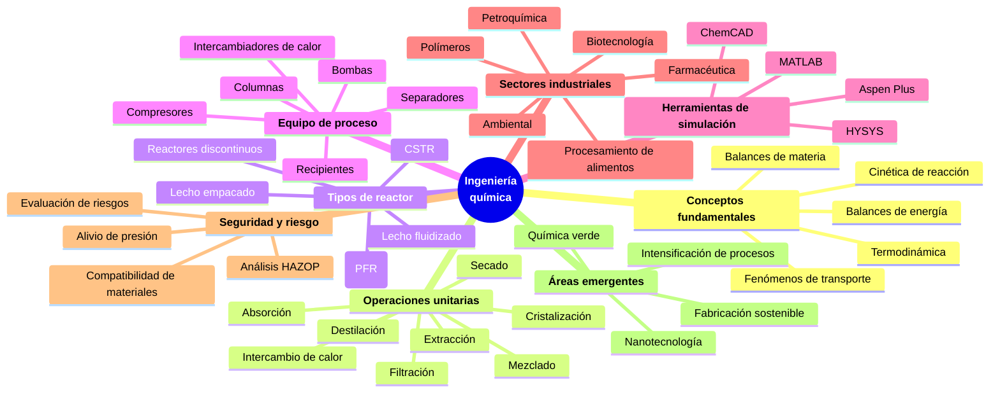

```mermaid
mindmap
  root((<b>Ingeniería<br>química</b>))
    <b>Conceptos fundamentales</b>
      Balances de materia
      Balances de energía
      Termodinámica
      Cinética de reacción
      Fenómenos de transporte
    <b>Operaciones unitarias</b>
      Destilación
      Absorción
      Extracción
      Cristalización
      Filtración
      Secado
      Mezclado
      Intercambio de calor
    <b>Tipos de reactor</b>
      Reactores discontinuos
      CSTR
      Flujo pistón (PFR)
      Lecho empacado
      Lecho fluidizado
    <b>Equipo de proceso</b>
      Intercambiadores de calor
      Bombas
      Compresores
      Separadores
      Columnas
      Recipientes
    <b>Herramientas de simulación</b>
      Aspen Plus
      HYSYS
      MATLAB
      ChemCAD
    <b>Sectores industriales</b>
      Petroquímica
      Farmacéutica
      Polímeros
      Procesamiento de alimentos
      Biotecnología
      Ambiental
    <b>Seguridad y riesgo</b>
      Análisis HAZOP
      Evaluación de riesgos
      Alivio de presión
      Compatibilidad de materiales
    <b>Áreas emergentes</b>
      Química verde
      Intensificación de procesos
      Nanotecnología
      Fabricación sostenible
```
