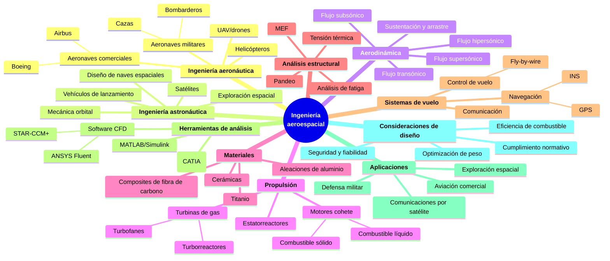

```mermaid
mindmap
  root((<b>Ingeniería<br>aeroespacial</b>))
    <b>Ingeniería aeronáutica</b>
      Aeronaves comerciales
        Boeing
        Airbus
      Aeronaves militares
        Cazas
        Bombarderos
      Helicópteros
      UAV/drones
    <b>Ingeniería astronáutica</b>
      Diseño de naves espaciales
      Satélites
      Vehículos de lanzamiento
      Mecánica orbital
      Exploración espacial
    <b>Aerodinámica</b>
      Flujo subsónico
      Flujo transónico
      Flujo supersónico
      Flujo hipersónico
      Sustentación y arrastre
    <b>Propulsión</b>
      Turbinas de gas
        Turborreactores
        Turbofanes
      Estatorreactores
      Motores cohete
        Combustible sólido
        Combustible líquido
    <b>Materiales</b>
      Aleaciones de aluminio
      Titanio
      Composites de fibra de carbono
      Cerámicas
    <b>Análisis estructural</b>
      MEF
      Análisis de fatiga
      Pandeo
      Tensión térmica
    <b>Sistemas de vuelo</b>
      Control de vuelo
        Fly-by-wire
      Navegación
        GPS
        INS
      Comunicación
    <b>Herramientas de análisis</b>
      Software CFD
        ANSYS Fluent
        STAR-CCM+
      CAD (CATIA)
      MATLAB/Simulink
    <b>Aplicaciones</b>
      Aviación comercial
      Exploración espacial
      Defensa militar
      Comunicaciones por satélite
    <b>Consideraciones de diseño</b>
      Optimización de peso
      Eficiencia de combustible
      Seguridad y fiabilidad
      Cumplimiento normativo
```
