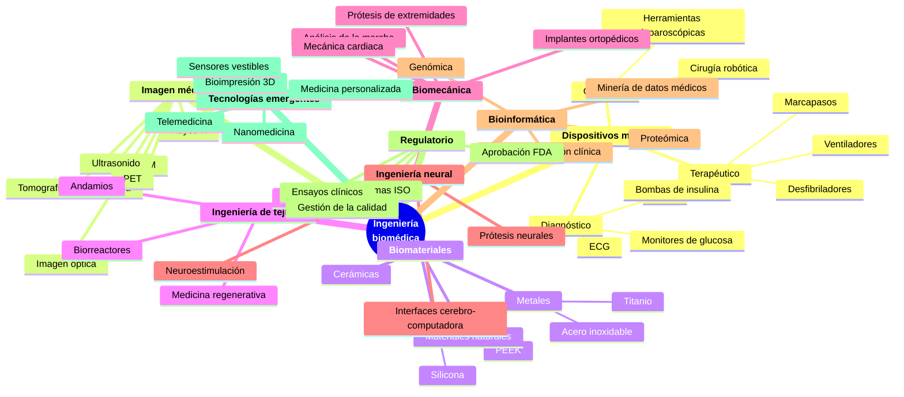

```mermaid
mindmap
  root((<b>Ingeniería<br>biomédica</b>))
    <b>Dispositivos médicos</b>
      Diagnóstico
        ECG
        EEG
        Monitores de glucosa
      Terapéutico
        Marcapasos
        Desfibriladores
        Bombas de insulina
        Ventiladores
      Quirúrgico
        Cirugía robótica
        Herramientas laparoscópicas
    <b>Imagen médica</b>
      Rayos X
      Tomografía computarizada
      RM
      Ultrasonido
      PET
      Imagen óptica
    <b>Biomateriales</b>
      Metales
        Titanio
        Acero inoxidable
      Polímeros
        PEEK
        Silicona
      Cerámicas
      Materiales naturales
    <b>Ingeniería de tejidos</b>
      Cultivo celular
      Andamios
      Biorreactores
      Medicina regenerativa
    <b>Biomecánica</b>
      Análisis de la marcha
      Prótesis de extremidades
      Implantes ortopédicos
      Mecánica cardiaca
    <b>Ingeniería neural</b>
      Interfaces cerebro-computadora
      Prótesis neurales
      Neuroestimulación
    <b>Bioinformática</b>
      Genómica
      Proteómica
      Minería de datos médicos
      Apoyo a la decisión clínica
    <b>Regulatorio</b>
      Aprobación FDA
      Normas ISO
      Ensayos clínicos
      Gestión de la calidad
    <b>Tecnologías emergentes</b>
      Nanomedicina
      Bioimpresión 3D
      Sensores vestibles
      Telemedicina
      Medicina personalizada
```
