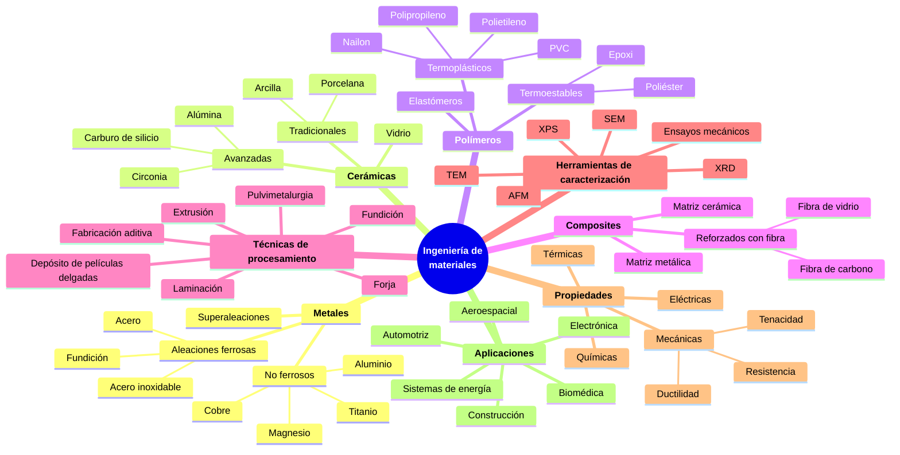

```mermaid
mindmap
  root((<b>Ingeniería de<br>materiales</b>))
    <b>Metales</b>
      Aleaciones ferrosas
        Acero
        Fundición
        Acero inoxidable
      No ferrosos
        Aluminio
        Titanio
        Cobre
        Magnesio
      Superaleaciones
    <b>Cerámicas</b>
      Tradicionales
        Arcilla
        Porcelana
      Avanzadas
        Alúmina
        Carburo de silicio
        Circonia
      Vidrio
    <b>Polímeros</b>
      Termoplásticos
        Polietileno
        Polipropileno
        PVC
        Nailon
      Termoestables
        Epoxi
        Poliéster
      Elastómeros
    <b>Composites</b>
      Reforzados con fibra
        Fibra de carbono
        Fibra de vidrio
      Matriz metálica
      Matriz cerámica
    <b>Técnicas de procesamiento</b>
      Fundición
      Forja
      Laminación
      Extrusión
      Pulvimetalurgia
      Fabricación aditiva
      Depósito de películas delgadas
    <b>Herramientas de caracterización</b>
      SEM
      TEM
      XRD
      XPS
      AFM
      Ensayos mecánicos
    <b>Propiedades</b>
      Mecánicas
        Resistencia
        Ductilidad
        Tenacidad
      Térmicas
      Eléctricas
      Químicas
    <b>Aplicaciones</b>
      Aeroespacial
      Automotriz
      Electrónica
      Sistemas de energía
      Biomédica
      Construcción
```
