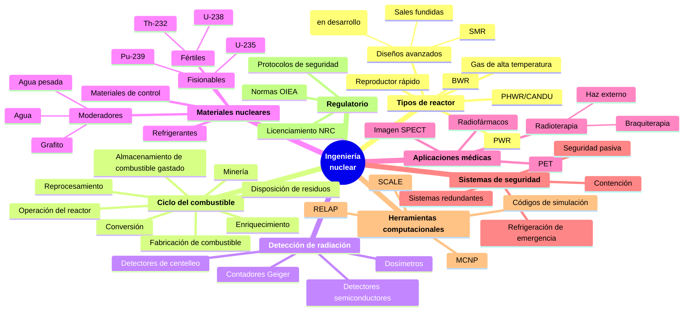

```mermaid
mindmap
  root((<b>Ingeniería<br>nuclear</b>))
    <b>Tipos de reactor</b>
      PWR
      BWR
      PHWR/CANDU
      Reproductor rápido
      Gas de alta temperatura
      Diseños avanzados
        SMR
        Sales fundidas
        Fusión (en desarrollo)
    <b>Ciclo del combustible</b>
      Minería
      Conversión
      Enriquecimiento
      Fabricación de combustible
      Operación del reactor
      Almacenamiento de combustible gastado
      Reprocesamiento
      Disposición de residuos
    <b>Detección de radiación</b>
      Contadores Geiger
      Detectores de centelleo
      Detectores semiconductores
      Dosímetros
    <b>Materiales nucleares</b>
      Fisionables
        U-235
        Pu-239
      Fértiles
        U-238
        Th-232
      Moderadores
        Agua
        Agua pesada
        Grafito
      Refrigerantes
      Materiales de control
    <b>Aplicaciones médicas</b>
      PET
      Imagen SPECT
      Radioterapia
        Haz externo
        Braquiterapia
      Radiofármacos
    <b>Sistemas de seguridad</b>
      Contención
      Refrigeración de emergencia
      Sistemas redundantes
      Seguridad pasiva
    <b>Herramientas computacionales</b>
      MCNP
      RELAP
      SCALE
      Códigos de simulación
    <b>Regulatorio</b>
      Licenciamiento NRC
      Normas OIEA
      Protocolos de seguridad
```
