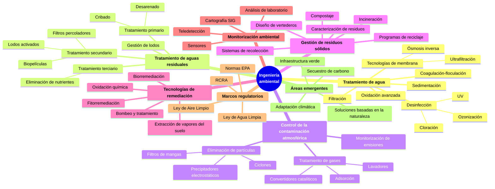

```mermaid
mindmap
  root((<b>Ingeniería<br>ambiental</b>))
    <b>Tratamiento de agua</b>
      Coagulación-floculación
      Sedimentación
      Filtración
      Desinfección
        Cloración
        UV
        Ozonización
      Tecnologías de membrana
        Ósmosis inversa
        Ultrafiltración
      Oxidación avanzada
    <b>Tratamiento de aguas residuales</b>
      Tratamiento primario
        Cribado
        Desarenado
      Tratamiento secundario
        Lodos activados
        Filtros percoladores
        Biopelículas
      Tratamiento terciario
        Eliminación de nutrientes
      Gestión de lodos
    <b>Control de la contaminación atmosférica</b>
      Eliminación de partículas
        Ciclones
        Precipitadores electrostáticos
        Filtros de mangas
      Tratamiento de gases
        Lavadores
        Convertidores catalíticos
        Adsorción
      Monitorización de emisiones
    <b>Gestión de residuos sólidos</b>
      Caracterización de residuos
      Sistemas de recolección
      Diseño de vertederos
      Incineración
      Compostaje
      Programas de reciclaje
    <b>Tecnologías de remediación</b>
      Extracción de vapores del suelo
      Biorremediación
      Fitorremediación
      Bombeo y tratamiento
      Oxidación química
    <b>Monitorización ambiental</b>
      Sensores
      Cartografía SIG
      Teledetección
      Análisis de laboratorio
    <b>Marcos regulatorios</b>
      Normas EPA
      Ley de Agua Limpia
      Ley de Aire Limpio
      RCRA
    <b>Áreas emergentes</b>
      Infraestructura verde
      Adaptación climática
      Secuestro de carbono
      Soluciones basadas en la naturaleza
```
