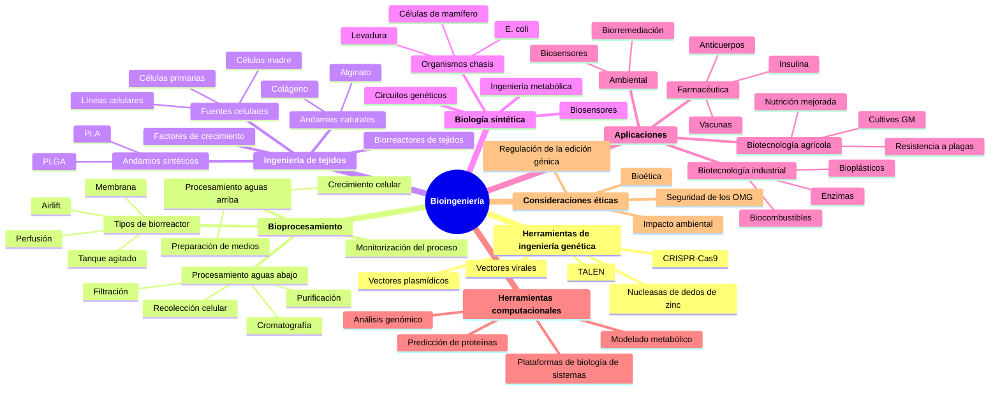

```mermaid
mindmap
  root((<b>Bioingeniería</b>))
    <b>Herramientas de ingeniería genética</b>
      CRISPR-Cas9
      TALEN
      Nucleasas de dedos de zinc
      Vectores plasmídicos
      Vectores virales
    <b>Bioprocesamiento</b>
      Procesamiento aguas arriba
        Preparación de medios
        Crecimiento celular
      Tipos de biorreactor
        Tanque agitado
        Airlift
        Membrana
        Perfusión
      Procesamiento aguas abajo
        Recolección celular
        Purificación
        Cromatografía
        Filtración
      Monitorización del proceso
    <b>Ingeniería de tejidos</b>
      Andamios naturales
        Colágeno
        Alginato
      Andamios sintéticos
        PLA
        PLGA
      Fuentes celulares
        Células madre
        Células primarias
        Líneas celulares
      Factores de crecimiento
      Biorreactores de tejidos
    <b>Biología sintética</b>
      Circuitos genéticos
      Biosensores
      Ingeniería metabólica
      Organismos chasis
        E. coli
        Levadura
        Células de mamífero
    <b>Aplicaciones</b>
      Farmacéutica
        Insulina
        Anticuerpos
        Vacunas
      Biotecnología agrícola
        Cultivos GM
        Resistencia a plagas
        Nutrición mejorada
      Biotecnología industrial
        Biocombustibles
        Bioplásticos
        Enzimas
      Ambiental
        Biorremediación
        Biosensores
    <b>Herramientas computacionales</b>
      Análisis genómico
      Predicción de proteínas
      Modelado metabólico
      Plataformas de biología de sistemas
    <b>Consideraciones éticas</b>
      Seguridad de los OMG
      Regulación de la edición génica
      Bioética
      Impacto ambiental
```
