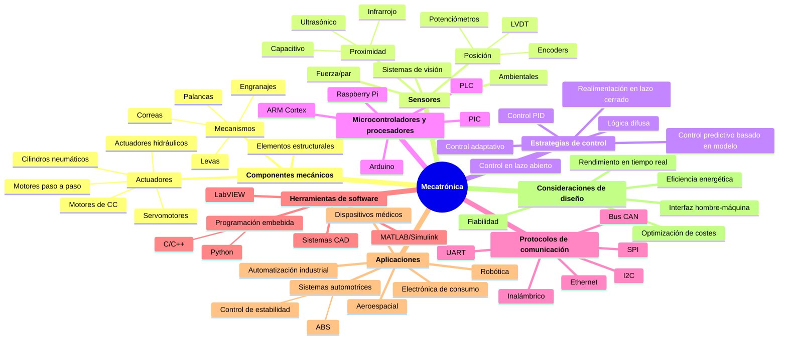

```mermaid
mindmap
  root((<b>Mecatrónica</b>))
    <b>Componentes mecánicos</b>
      Actuadores
        Motores de CC
        Motores paso a paso
        Servomotores
        Cilindros neumáticos
        Actuadores hidráulicos
      Mecanismos
        Engranajes
        Palancas
        Levas
        Correas
      Elementos estructurales
    <b>Sensores</b>
      Posición
        Encoders
        Potenciómetros
        LVDT
      Fuerza/par
      Proximidad
        Ultrasónico
        Infrarrojo
        Capacitivo
      Sistemas de visión
      Ambientales
    <b>Estrategias de control</b>
      Control en lazo abierto
      Realimentación en lazo cerrado
      Control PID
      Control adaptativo
      Lógica difusa
      Control predictivo basado en modelo
    <b>Microcontroladores y procesadores</b>
      Arduino
      Raspberry Pi
      PIC
      ARM Cortex
      PLC
    <b>Protocolos de comunicación</b>
      I2C
      SPI
      UART
      Bus CAN
      Ethernet
      Inalámbrico
    <b>Herramientas de software</b>
      MATLAB/Simulink
      LabVIEW
      Sistemas CAD
      Programación embebida
        C/C++
        Python
    <b>Aplicaciones</b>
      Automatización industrial
      Robótica
      Sistemas automotrices
        ABS
        Control de estabilidad
      Electrónica de consumo
      Aeroespacial
      Dispositivos médicos
    <b>Consideraciones de diseño</b>
      Rendimiento en tiempo real
      Fiabilidad
      Optimización de costes
      Eficiencia energética
      Interfaz hombre-máquina
```
