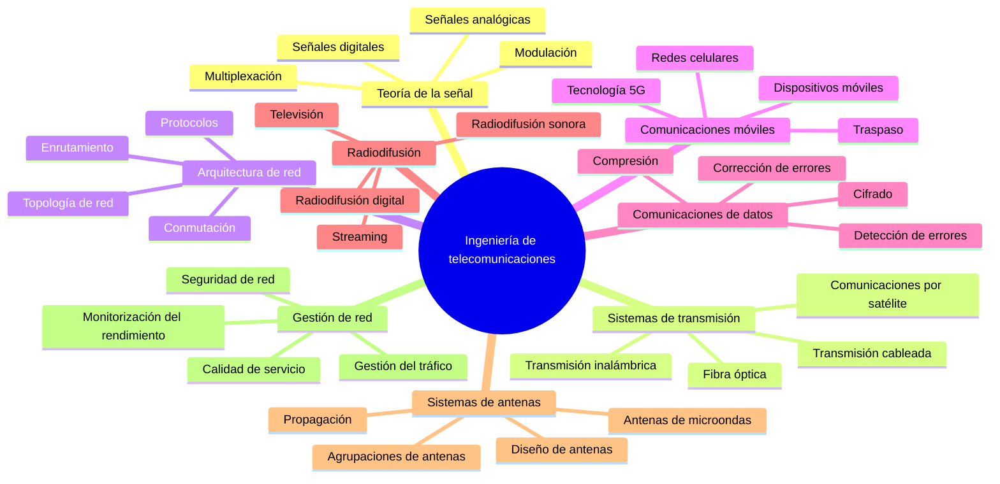

```mermaid
mindmap
  root((Ingeniería de telecomunicaciones))
    Teoría de la señal
      Señales analógicas
      Señales digitales
      Modulación
      Multiplexación
    Sistemas de transmisión
      Transmisión cableada
      Transmisión inalámbrica
      Fibra óptica
      Comunicaciones por satélite
    Arquitectura de red
      Topología de red
      Protocolos
      Conmutación
      Enrutamiento
    Comunicaciones móviles
      Redes celulares
      Tecnología 5G
      Dispositivos móviles
      Traspaso
    Comunicaciones de datos
      Detección de errores
      Corrección de errores
      Compresión
      Cifrado
    Radiodifusión
      Radiodifusión sonora
      Televisión
      Radiodifusión digital
      Streaming
    Sistemas de antenas
      Diseño de antenas
      Propagación
      Agrupaciones de antenas
      Antenas de microondas
    Gestión de red
      Monitorización del rendimiento
      Calidad de servicio
      Gestión del tráfico
      Seguridad de red
```
