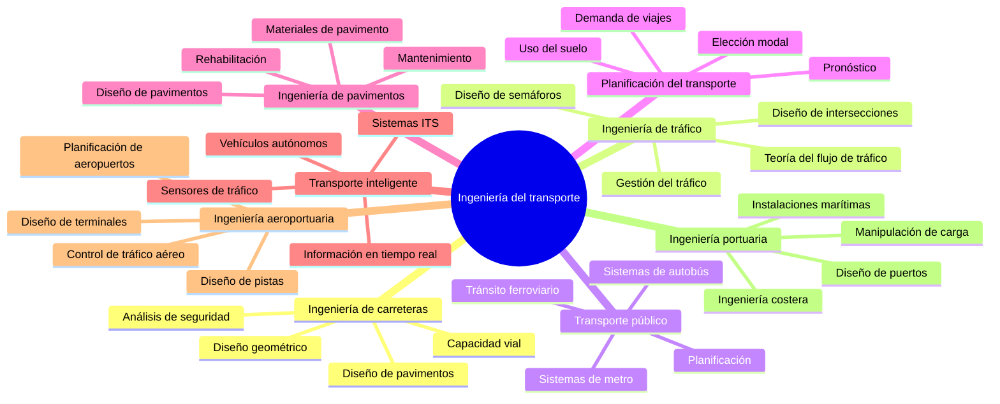

```mermaid
mindmap
  root((Ingeniería del transporte))
    Ingeniería de carreteras
      Diseño geométrico
      Diseño de pavimentos
      Capacidad vial
      Análisis de seguridad
    Ingeniería de tráfico
      Teoría del flujo de tráfico
      Diseño de semáforos
      Diseño de intersecciones
      Gestión del tráfico
    Transporte público
      Sistemas de autobús
      Tránsito ferroviario
      Sistemas de metro
      Planificación
    Planificación del transporte
      Demanda de viajes
      Elección modal
      Uso del suelo
      Pronóstico
    Ingeniería de pavimentos
      Materiales de pavimento
      Diseño de pavimentos
      Mantenimiento
      Rehabilitación
    Transporte inteligente
      Sistemas ITS
      Sensores de tráfico
      Información en tiempo real
      Vehículos autónomos
    Ingeniería aeroportuaria
      Diseño de pistas
      Diseño de terminales
      Control de tráfico aéreo
      Planificación de aeropuertos
    Ingeniería portuaria
      Diseño de puertos
      Instalaciones marítimas
      Manipulación de carga
      Ingeniería costera
```
