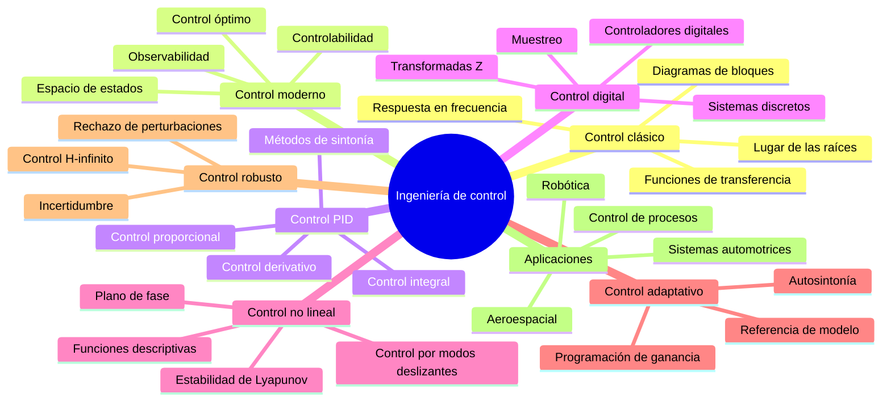

```mermaid
mindmap
  root((Ingeniería de control))
    Control clásico
      Funciones de transferencia
      Diagramas de bloques
      Lugar de las raíces
      Respuesta en frecuencia
    Control moderno
      Espacio de estados
      Controlabilidad
      Observabilidad
      Control óptimo
    Control PID
      Control proporcional
      Control integral
      Control derivativo
      Métodos de sintonía
    Control digital
      Muestreo
      Transformadas Z
      Sistemas discretos
      Controladores digitales
    Control no lineal
      Plano de fase
      Funciones descriptivas
      Estabilidad de Lyapunov
      Control por modos deslizantes
    Control adaptativo
      Referencia de modelo
      Autosintonía
      Programación de ganancia
    Control robusto
      Control H-infinito
      Incertidumbre
      Rechazo de perturbaciones
    Aplicaciones
      Control de procesos
      Robótica
      Aeroespacial
      Sistemas automotrices
```
