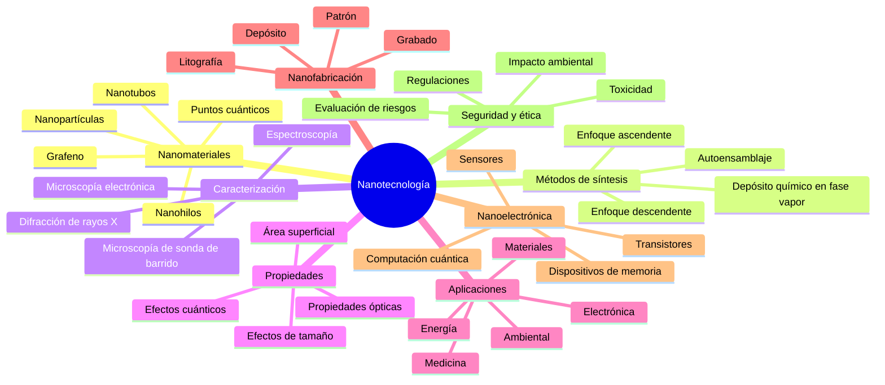

```mermaid
mindmap
  root((Nanotecnología))
    Nanomateriales
      Nanopartículas
      Nanotubos
      Nanohilos
      Puntos cuánticos
      Grafeno
    Métodos de síntesis
      Enfoque descendente
      Enfoque ascendente
      Autoensamblaje
      Depósito químico en fase vapor
    Caracterización
      Microscopía electrónica
      Microscopía de sonda de barrido
      Espectroscopía
      Difracción de rayos X
    Propiedades
      Efectos de tamaño
      Área superficial
      Efectos cuánticos
      Propiedades ópticas
    Aplicaciones
      Electrónica
      Medicina
      Energía
      Ambiental
      Materiales
    Nanofabricación
      Litografía
      Grabado
      Depósito
      Patrón
    Nanoelectrónica
      Transistores
      Dispositivos de memoria
      Sensores
      Computación cuántica
    Seguridad y ética
      Toxicidad
      Impacto ambiental
      Regulaciones
      Evaluación de riesgos
```
