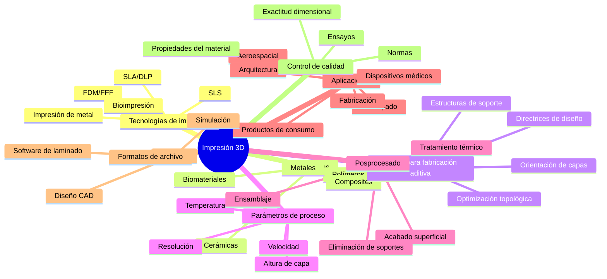

```mermaid
mindmap
  root((Impresión 3D))
    Tecnologías de impresión
      FDM/FFF
      SLA/DLP
      SLS
      Impresión de metal
      Bioimpresión
    Materiales
      Polímeros
      Metales
      Cerámicas
      Composites
      Biomateriales
    Diseño para fabricación aditiva
      Optimización topológica
      Estructuras de soporte
      Orientación de capas
      Directrices de diseño
    Parámetros de proceso
      Resolución
      Velocidad
      Temperatura
      Altura de capa
    Posprocesado
      Acabado superficial
      Tratamiento térmico
      Eliminación de soportes
      Ensamblaje
    Aplicaciones
      Prototipado
      Fabricación
      Dispositivos médicos
      Aeroespacial
      Arquitectura
      Productos de consumo
    Software
      Diseño CAD
      Software de laminado
      Simulación
      Formatos de archivo
    Control de calidad
      Exactitud dimensional
      Propiedades del material
      Ensayos
      Normas
```
