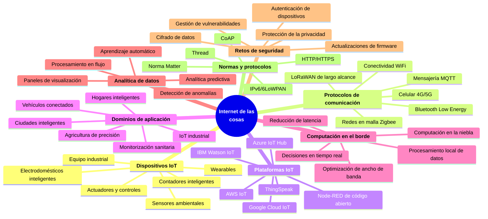

```mermaid
mindmap
  root((<b>Internet de las<br>cosas</b>))
    <b>Dispositivos IoT</b>
      Sensores ambientales
      Actuadores y controles
      Wearables
      Electrodomésticos inteligentes
      Equipo industrial
      Contadores inteligentes
    <b>Protocolos de comunicación</b>
      Conectividad WiFi
      Bluetooth Low Energy
      Celular 4G/5G
      LoRaWAN de largo alcance
      Redes en malla Zigbee
      Mensajería MQTT
    <b>Plataformas IoT</b>
      AWS IoT
      Azure IoT Hub
      Google Cloud IoT
      ThingSpeak
      Node-RED de código abierto
      IBM Watson IoT
    <b>Dominios de aplicación</b>
      Hogares inteligentes
      IoT industrial
      Ciudades inteligentes
      Monitorización sanitaria
      Agricultura de precisión
      Vehículos conectados
    <b>Computación en el borde</b>
      Procesamiento local de datos
      Reducción de latencia
      Optimización de ancho de banda
      Decisiones en tiempo real
      Computación en la niebla
    <b>Analítica de datos</b>
      Procesamiento en flujo
      Analítica predictiva
      Detección de anomalías
      Aprendizaje automático
      Paneles de visualización
    <b>Retos de seguridad</b>
      Autenticación de dispositivos
      Cifrado de datos
      Protección de la privacidad
      Actualizaciones de firmware
      Gestión de vulnerabilidades
    <b>Normas y protocolos</b>
      HTTP/HTTPS
      CoAP
      IPv6/6LoWPAN
      Thread
      Norma Matter
```
