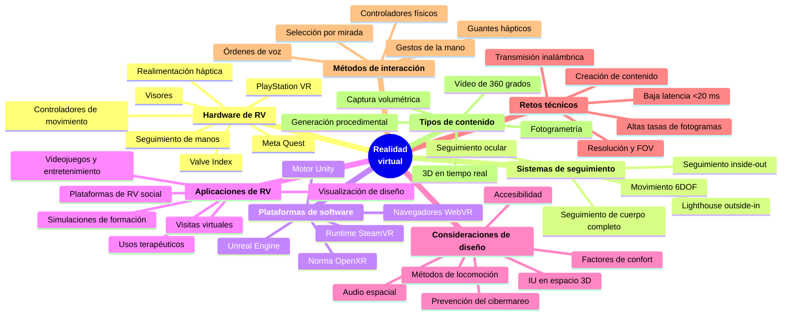

```mermaid
mindmap
  root((<b>Realidad<br>virtual</b>))
    <b>Hardware de RV</b>
      Visores
      Meta Quest
      PlayStation VR
      Valve Index
      Controladores de movimiento
      Seguimiento de manos
      Realimentación háptica
    <b>Sistemas de seguimiento</b>
      Seguimiento inside-out
      Lighthouse outside-in
      Movimiento 6DOF
      Seguimiento ocular
      Seguimiento de cuerpo completo
    <b>Plataformas de software</b>
      Motor Unity
      Unreal Engine
      Navegadores WebVR
      Runtime SteamVR
      Norma OpenXR
    <b>Aplicaciones de RV</b>
      Videojuegos y entretenimiento
      Simulaciones de formación
      Visitas virtuales
      Plataformas de RV social
      Usos terapéuticos
      Visualización de diseño
    <b>Consideraciones de diseño</b>
      Métodos de locomoción
      IU en espacio 3D
      Audio espacial
      Accesibilidad
      Factores de confort
      Prevención del cibermareo
    <b>Retos técnicos</b>
      Altas tasas de fotogramas
      Baja latencia <20 ms
      Resolución y FOV
      Transmisión inalámbrica
      Creación de contenido
    <b>Métodos de interacción</b>
      Gestos de la mano
      Órdenes de voz
      Selección por mirada
      Controladores físicos
      Guantes hápticos
    <b>Tipos de contenido</b>
      Vídeo de 360 grados
      3D en tiempo real
      Fotogrametría
      Captura volumétrica
      Generación procedimental
```
