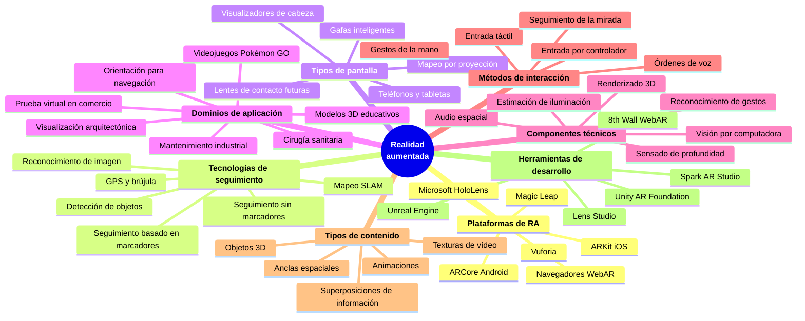

```mermaid
mindmap
  root((<b>Realidad<br>aumentada</b>))
    <b>Plataformas de RA</b>
      ARKit iOS
      ARCore Android
      Microsoft HoloLens
      Magic Leap
      Navegadores WebAR
      Vuforia
    <b>Tecnologías de seguimiento</b>
      Seguimiento basado en marcadores
      Seguimiento sin marcadores
      Mapeo SLAM
      GPS y brújula
      Reconocimiento de imagen
      Detección de objetos
    <b>Tipos de pantalla</b>
      Teléfonos y tabletas
      Gafas inteligentes
      Visualizadores de cabeza
      Lentes de contacto futuras
      Mapeo por proyección
    <b>Dominios de aplicación</b>
      Prueba virtual en comercio
      Orientación para navegación
      Videojuegos Pokémon GO
      Modelos 3D educativos
      Mantenimiento industrial
      Cirugía sanitaria
      Visualización arquitectónica
    <b>Componentes técnicos</b>
      Visión por computadora
      Renderizado 3D
      Audio espacial
      Reconocimiento de gestos
      Sensado de profundidad
      Estimación de iluminación
    <b>Métodos de interacción</b>
      Entrada táctil
      Gestos de la mano
      Órdenes de voz
      Seguimiento de la mirada
      Entrada por controlador
    <b>Tipos de contenido</b>
      Objetos 3D
      Superposiciones de información
      Animaciones
      Texturas de vídeo
      Anclas espaciales
    <b>Herramientas de desarrollo</b>
      Unity AR Foundation
      Unreal Engine
      8th Wall WebAR
      Spark AR Studio
      Lens Studio
```
