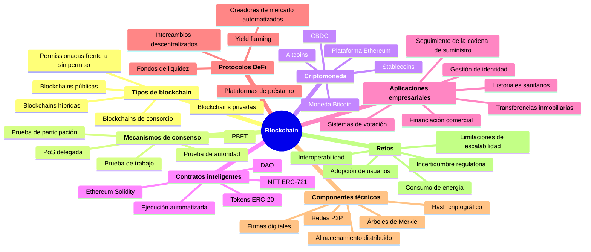

```mermaid
mindmap
  root((<b>Blockchain</b>))
    <b>Tipos de blockchain</b>
      Blockchains públicas
      Blockchains privadas
      Blockchains de consorcio
      Blockchains híbridas
      Permissionadas frente a sin permiso
    <b>Mecanismos de consenso</b>
      Prueba de trabajo
      Prueba de participación
      PoS delegada
      PBFT
      Prueba de autoridad
    <b>Criptomoneda</b>
      Moneda Bitcoin
      Plataforma Ethereum
      Stablecoins
      CBDC
      Altcoins
    <b>Contratos inteligentes</b>
      Ethereum Solidity
      DAO
      Tokens ERC-20
      NFT ERC-721
      Ejecución automatizada
    <b>Aplicaciones empresariales</b>
      Seguimiento de la cadena de suministro
      Historiales sanitarios
      Gestión de identidad
      Sistemas de votación
      Transferencias inmobiliarias
      Financiación comercial
    <b>Protocolos DeFi</b>
      Intercambios descentralizados
      Plataformas de préstamo
      Yield farming
      Fondos de liquidez
      Creadores de mercado automatizados
    <b>Componentes técnicos</b>
      Hash criptográfico
      Firmas digitales
      Árboles de Merkle
      Almacenamiento distribuido
      Redes P2P
    <b>Retos</b>
      Limitaciones de escalabilidad
      Consumo de energía
      Incertidumbre regulatoria
      Interoperabilidad
      Adopción de usuarios
```
