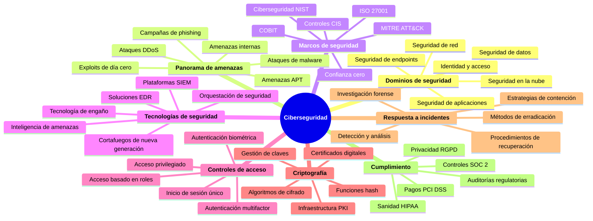

```mermaid
mindmap
  root((<b>Ciberseguridad</b>))
    <b>Dominios de seguridad</b>
      Seguridad de red
      Seguridad de aplicaciones
      Seguridad de endpoints
      Seguridad en la nube
      Identidad y acceso
      Seguridad de datos
    <b>Panorama de amenazas</b>
      Ataques de malware
      Campañas de phishing
      Amenazas APT
      Amenazas internas
      Ataques DDoS
      Exploits de día cero
    <b>Marcos de seguridad</b>
      Ciberseguridad NIST
      ISO 27001
      Controles CIS
      MITRE ATT&CK
      Confianza cero
      COBIT
    <b>Tecnologías de seguridad</b>
      Cortafuegos de nueva generación
      Plataformas SIEM
      Soluciones EDR
      Orquestación de seguridad
      Inteligencia de amenazas
      Tecnología de engaño
    <b>Controles de acceso</b>
      Autenticación multifactor
      Inicio de sesión único
      Acceso privilegiado
      Acceso basado en roles
      Autenticación biométrica
    <b>Criptografía</b>
      Algoritmos de cifrado
      Infraestructura PKI
      Certificados digitales
      Funciones hash
      Gestión de claves
    <b>Respuesta a incidentes</b>
      Detección y análisis
      Estrategias de contención
      Métodos de erradicación
      Procedimientos de recuperación
      Investigación forense
    <b>Cumplimiento</b>
      Privacidad RGPD
      Sanidad HIPAA
      Pagos PCI DSS
      Controles SOC 2
      Auditorías regulatorias
```
