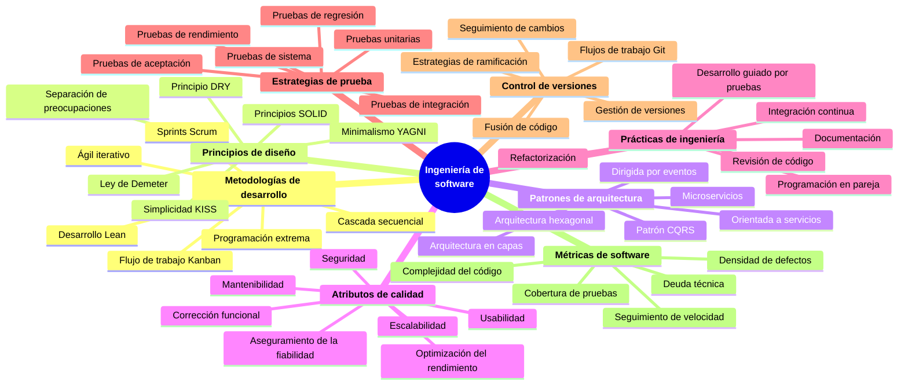

```mermaid
mindmap
  root((<b>Ingeniería de<br>software</b>))
    <b>Metodologías de desarrollo</b>
      Cascada secuencial
      Ágil iterativo
      Sprints Scrum
      Programación extrema
      Flujo de trabajo Kanban
      Desarrollo Lean
    <b>Principios de diseño</b>
      Principios SOLID
      Separación de preocupaciones
      Principio DRY
      Simplicidad KISS
      Minimalismo YAGNI
      Ley de Demeter
    <b>Patrones de arquitectura</b>
      Arquitectura en capas
      Microservicios
      Dirigida por eventos
      Orientada a servicios
      Arquitectura hexagonal
      Patrón CQRS
    <b>Atributos de calidad</b>
      Corrección funcional
      Optimización del rendimiento
      Aseguramiento de la fiabilidad
      Mantenibilidad
      Escalabilidad
      Seguridad
      Usabilidad
    <b>Prácticas de ingeniería</b>
      Revisión de código
      Integración continua
      Desarrollo guiado por pruebas
      Refactorización
      Programación en pareja
      Documentación
    <b>Estrategias de prueba</b>
      Pruebas unitarias
      Pruebas de integración
      Pruebas de sistema
      Pruebas de aceptación
      Pruebas de regresión
      Pruebas de rendimiento
    <b>Control de versiones</b>
      Flujos de trabajo Git
      Estrategias de ramificación
      Fusión de código
      Gestión de versiones
      Seguimiento de cambios
    <b>Métricas de software</b>
      Complejidad del código
      Cobertura de pruebas
      Densidad de defectos
      Deuda técnica
      Seguimiento de velocidad
```
