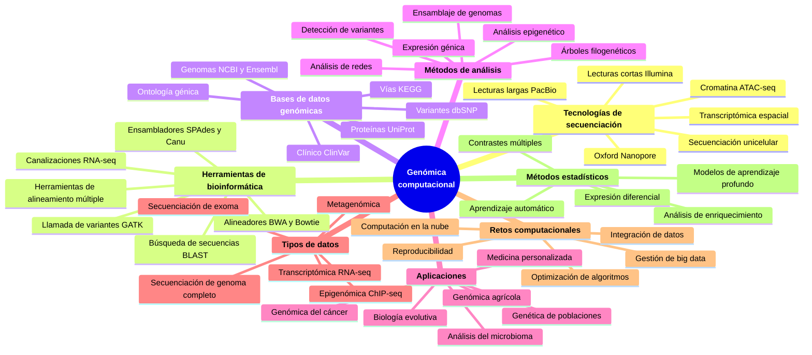

```mermaid
mindmap
  root((<b>Genómica<br>computacional</b>))
    <b>Tecnologías de secuenciación</b>
      Lecturas cortas Illumina
      Lecturas largas PacBio
      Oxford Nanopore
      Secuenciación unicelular
      Transcriptómica espacial
      Cromatina ATAC-seq
    <b>Herramientas de bioinformática</b>
      Alineadores BWA y Bowtie
      Ensambladores SPAdes y Canu
      Llamada de variantes GATK
      Canalizaciones RNA-seq
      Búsqueda de secuencias BLAST
      Herramientas de alineamiento múltiple
    <b>Bases de datos genómicas</b>
      Genomas NCBI y Ensembl
      Variantes dbSNP
      Clínico ClinVar
      Ontología génica
      Vías KEGG
      Proteínas UniProt
    <b>Métodos de análisis</b>
      Ensamblaje de genomas
      Detección de variantes
      Expresión génica
      Análisis epigenético
      Árboles filogenéticos
      Análisis de redes
    <b>Aplicaciones</b>
      Medicina personalizada
      Genómica del cáncer
      Genética de poblaciones
      Genómica agrícola
      Análisis del microbioma
      Biología evolutiva
    <b>Tipos de datos</b>
      Secuenciación de genoma completo
      Secuenciación de exoma
      Transcriptómica RNA-seq
      Epigenómica ChIP-seq
      Metagenómica
    <b>Retos computacionales</b>
      Gestión de big data
      Optimización de algoritmos
      Reproducibilidad
      Integración de datos
      Computación en la nube
    <b>Métodos estadísticos</b>
      Expresión diferencial
      Análisis de enriquecimiento
      Contrastes múltiples
      Aprendizaje automático
      Modelos de aprendizaje profundo
```
