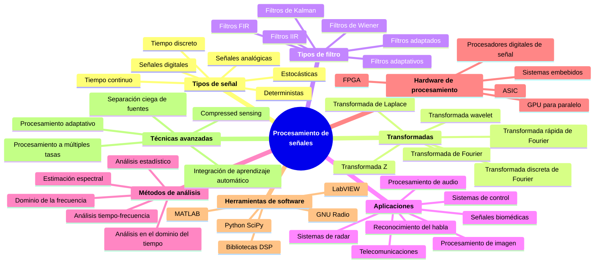

```mermaid
mindmap
  root((<b>Procesamiento de<br>señales</b>))
    <b>Tipos de señal</b>
      Tiempo continuo
      Tiempo discreto
      Señales analógicas
      Señales digitales
      Deterministas
      Estocásticas
    <b>Transformadas</b>
      Transformada de Fourier
      Transformada discreta de Fourier
      Transformada rápida de Fourier
      Transformada wavelet
      Transformada de Laplace
      Transformada Z
    <b>Tipos de filtro</b>
      Filtros FIR
      Filtros IIR
      Filtros adaptativos
      Filtros adaptados
      Filtros de Wiener
      Filtros de Kalman
    <b>Aplicaciones</b>
      Telecomunicaciones
      Procesamiento de audio
      Procesamiento de imagen
      Señales biomédicas
      Sistemas de radar
      Reconocimiento del habla
      Sistemas de control
    <b>Métodos de análisis</b>
      Análisis en el dominio del tiempo
      Dominio de la frecuencia
      Análisis tiempo-frecuencia
      Análisis estadístico
      Estimación espectral
    <b>Hardware de procesamiento</b>
      Procesadores digitales de señal
      FPGA
      ASIC
      GPU para paralelo
      Sistemas embebidos
    <b>Herramientas de software</b>
      MATLAB
      Python SciPy
      GNU Radio
      LabVIEW
      Bibliotecas DSP
    <b>Técnicas avanzadas</b>
      Procesamiento adaptativo
      Procesamiento a múltiples tasas
      Compressed sensing
      Separación ciega de fuentes
      Integración de aprendizaje automático
```
