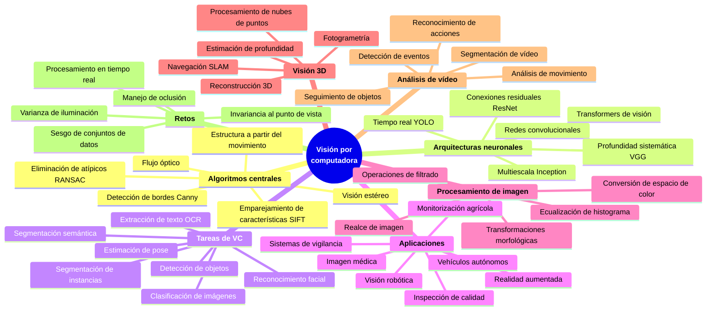

```mermaid
mindmap
  root((<b>Visión por<br>computadora</b>))
    <b>Algoritmos centrales</b>
      Detección de bordes Canny
      Emparejamiento de características SIFT
      Flujo óptico
      Estructura a partir del movimiento
      Visión estéreo
      Eliminación de atípicos RANSAC
    <b>Arquitecturas neuronales</b>
      Redes convolucionales
      Conexiones residuales ResNet
      Profundidad sistemática VGG
      Multiescala Inception
      Tiempo real YOLO
      Transformers de visión
    <b>Tareas de VC</b>
      Clasificación de imágenes
      Detección de objetos
      Segmentación semántica
      Segmentación de instancias
      Estimación de pose
      Reconocimiento facial
      Extracción de texto OCR
    <b>Aplicaciones</b>
      Vehículos autónomos
      Imagen médica
      Sistemas de vigilancia
      Visión robótica
      Realidad aumentada
      Inspección de calidad
      Monitorización agrícola
    <b>Procesamiento de imagen</b>
      Operaciones de filtrado
      Transformaciones morfológicas
      Ecualización de histograma
      Conversión de espacio de color
      Realce de imagen
    <b>Visión 3D</b>
      Estimación de profundidad
      Procesamiento de nubes de puntos
      Reconstrucción 3D
      Navegación SLAM
      Fotogrametría
    <b>Análisis de vídeo</b>
      Reconocimiento de acciones
      Seguimiento de objetos
      Segmentación de vídeo
      Análisis de movimiento
      Detección de eventos
    <b>Retos</b>
      Manejo de oclusión
      Varianza de iluminación
      Invariancia al punto de vista
      Procesamiento en tiempo real
      Sesgo de conjuntos de datos
```
