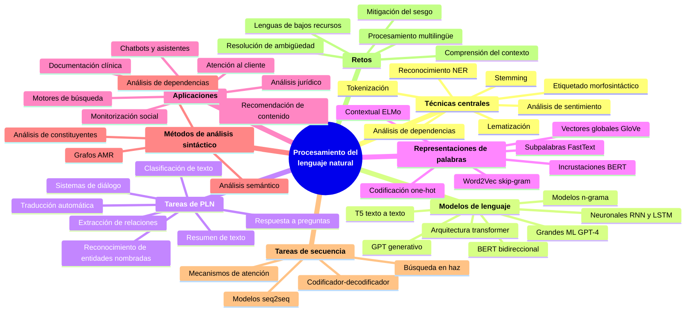

```mermaid
mindmap
  root((<b>Procesamiento del<br>lenguaje natural</b>))
    <b>Técnicas centrales</b>
      Tokenización
      Lematización
      Stemming
      Etiquetado morfosintáctico
      Reconocimiento NER
      Análisis de dependencias
      Análisis de sentimiento
    <b>Modelos de lenguaje</b>
      Modelos n-grama
      Neuronales RNN y LSTM
      Arquitectura transformer
      BERT bidireccional
      GPT generativo
      T5 texto a texto
      Grandes ML GPT-4
    <b>Tareas de PLN</b>
      Clasificación de texto
      Traducción automática
      Respuesta a preguntas
      Resumen de texto
      Reconocimiento de entidades nombradas
      Extracción de relaciones
      Sistemas de diálogo
    <b>Representaciones de palabras</b>
      Codificación one-hot
      Word2Vec skip-gram
      Vectores globales GloVe
      Subpalabras FastText
      Contextual ELMo
      Incrustaciones BERT
    <b>Aplicaciones</b>
      Chatbots y asistentes
      Motores de búsqueda
      Recomendación de contenido
      Atención al cliente
      Documentación clínica
      Análisis jurídico
      Monitorización social
    <b>Métodos de análisis sintáctico</b>
      Análisis de constituyentes
      Análisis de dependencias
      Análisis semántico
      Grafos AMR
    <b>Tareas de secuencia</b>
      Modelos seq2seq
      Mecanismos de atención
      Codificador-decodificador
      Búsqueda en haz
    <b>Retos</b>
      Resolución de ambigüedad
      Comprensión del contexto
      Procesamiento multilingüe
      Lenguas de bajos recursos
      Mitigación del sesgo
```
