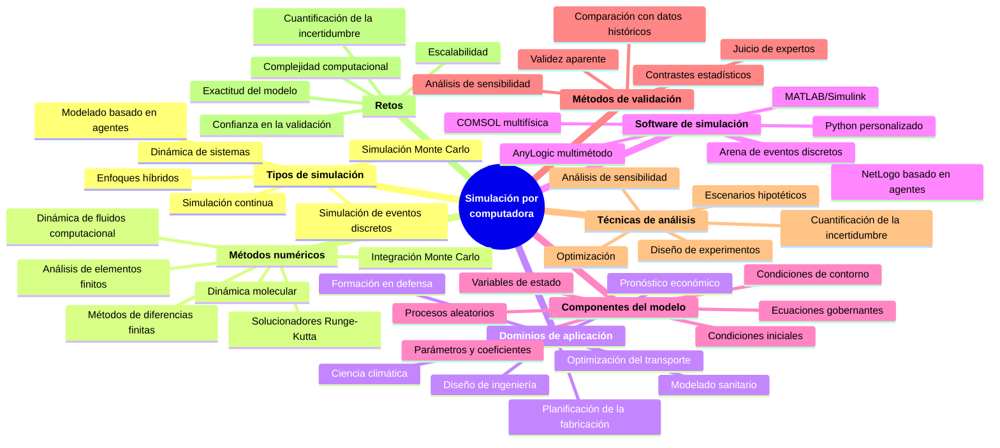

```mermaid
mindmap
  root((<b>Simulación por<br>computadora</b>))
    <b>Tipos de simulación</b>
      Simulación de eventos discretos
      Simulación continua
      Modelado basado en agentes
      Dinámica de sistemas
      Simulación Monte Carlo
      Enfoques híbridos
    <b>Métodos numéricos</b>
      Métodos de diferencias finitas
      Análisis de elementos finitos
      Solucionadores Runge-Kutta
      Integración Monte Carlo
      Dinámica de fluidos computacional
      Dinámica molecular
    <b>Dominios de aplicación</b>
      Diseño de ingeniería
      Modelado sanitario
      Pronóstico económico
      Ciencia climática
      Optimización del transporte
      Planificación de la fabricación
      Formación en defensa
    <b>Software de simulación</b>
      MATLAB/Simulink
      AnyLogic multimétodo
      Arena de eventos discretos
      NetLogo basado en agentes
      COMSOL multifísica
      Python personalizado
    <b>Componentes del modelo</b>
      Variables de estado
      Ecuaciones gobernantes
      Condiciones de contorno
      Condiciones iniciales
      Parámetros y coeficientes
      Procesos aleatorios
    <b>Métodos de validación</b>
      Comparación con datos históricos
      Juicio de expertos
      Análisis de sensibilidad
      Validez aparente
      Contrastes estadísticos
    <b>Técnicas de análisis</b>
      Escenarios hipotéticos
      Optimización
      Análisis de sensibilidad
      Cuantificación de la incertidumbre
      Diseño de experimentos
    <b>Retos</b>
      Complejidad computacional
      Exactitud del modelo
      Cuantificación de la incertidumbre
      Confianza en la validación
      Escalabilidad
```
