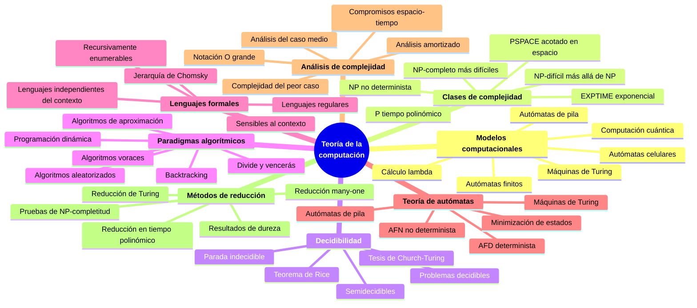

```mermaid
mindmap
  root((<b>Teoría de la<br>computación</b>))
    <b>Modelos computacionales</b>
      Máquinas de Turing
      Autómatas finitos
      Autómatas de pila
      Cálculo lambda
      Autómatas celulares
      Computación cuántica
    <b>Clases de complejidad</b>
      P tiempo polinómico
      NP no determinista
      NP-completo más difíciles
      NP-difícil más allá de NP
      PSPACE acotado en espacio
      EXPTIME exponencial
    <b>Decidibilidad</b>
      Problemas decidibles
      Parada indecidible
      Semidecidibles
      Tesis de Church-Turing
      Teorema de Rice
    <b>Paradigmas algorítmicos</b>
      Divide y vencerás
      Programación dinámica
      Algoritmos voraces
      Backtracking
      Algoritmos de aproximación
      Algoritmos aleatorizados
    <b>Lenguajes formales</b>
      Lenguajes regulares
      Lenguajes independientes del contexto
      Sensibles al contexto
      Recursivamente enumerables
      Jerarquía de Chomsky
    <b>Teoría de autómatas</b>
      AFD determinista
      AFN no determinista
      Autómatas de pila
      Máquinas de Turing
      Minimización de estados
    <b>Análisis de complejidad</b>
      Complejidad del peor caso
      Análisis del caso medio
      Análisis amortizado
      Notación O grande
      Compromisos espacio-tiempo
    <b>Métodos de reducción</b>
      Reducción en tiempo polinómico
      Reducción many-one
      Reducción de Turing
      Pruebas de NP-completitud
      Resultados de dureza
```
