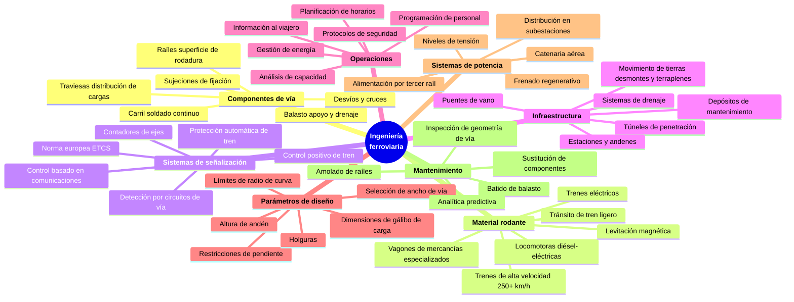

```mermaid
mindmap
  root((<b>Ingeniería<br>ferroviaria</b>))
    <b>Componentes de vía</b>
      Raíles superficie de rodadura
      Traviesas distribución de cargas
      Balasto apoyo y drenaje
      Sujeciones de fijación
      Desvíos y cruces
      Carril soldado continuo
    <b>Material rodante</b>
      Locomotoras diésel-eléctricas
      Trenes eléctricos
      Trenes de alta velocidad 250+ km/h
      Tránsito de tren ligero
      Vagones de mercancías especializados
      Levitación magnética
    <b>Sistemas de señalización</b>
      Detección por circuitos de vía
      Contadores de ejes
      Protección automática de tren
      Control positivo de tren
      Norma europea ETCS
      Control basado en comunicaciones
    <b>Infraestructura</b>
      Movimiento de tierras desmontes y terraplenes
      Puentes de vano
      Túneles de penetración
      Estaciones y andenes
      Depósitos de mantenimiento
      Sistemas de drenaje
    <b>Operaciones</b>
      Planificación de horarios
      Análisis de capacidad
      Gestión de energía
      Protocolos de seguridad
      Información al viajero
      Programación de personal
    <b>Parámetros de diseño</b>
      Selección de ancho de vía
      Dimensiones de gálibo de carga
      Límites de radio de curva
      Restricciones de pendiente
      Altura de andén
      Holguras
    <b>Sistemas de potencia</b>
      Catenaria aérea
      Alimentación por tercer raíl
      Distribución en subestaciones
      Frenado regenerativo
      Niveles de tensión
    <b>Mantenimiento</b>
      Inspección de geometría de vía
      Amolado de raíles
      Batido de balasto
      Sustitución de componentes
      Analítica predictiva
```
