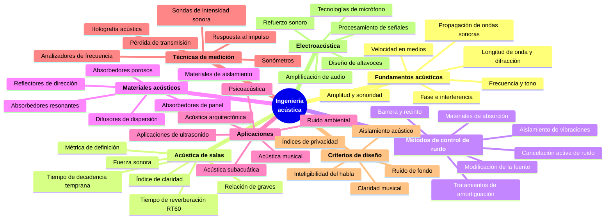

```mermaid
mindmap
  root((<b>Ingeniería<br>acústica</b>))
    <b>Fundamentos acústicos</b>
      Propagación de ondas sonoras
      Frecuencia y tono
      Longitud de onda y difracción
      Amplitud y sonoridad
      Fase e interferencia
      Velocidad en medios
    <b>Acústica de salas</b>
      Tiempo de reverberación RT60
      Tiempo de decadencia temprana
      Índice de claridad
      Métrica de definición
      Fuerza sonora
      Relación de graves
    <b>Métodos de control de ruido</b>
      Modificación de la fuente
      Barrera y recinto
      Materiales de absorción
      Aislamiento de vibraciones
      Cancelación activa de ruido
      Tratamientos de amortiguación
    <b>Materiales acústicos</b>
      Absorbedores porosos
      Absorbedores de panel
      Absorbedores resonantes
      Difusores de dispersión
      Reflectores de dirección
      Materiales de aislamiento
    <b>Aplicaciones</b>
      Acústica arquitectónica
      Ruido ambiental
      Acústica subacuática
      Acústica musical
      Psicoacústica
      Aplicaciones de ultrasonido
    <b>Técnicas de medición</b>
      Sonómetros
      Analizadores de frecuencia
      Respuesta al impulso
      Sondas de intensidad sonora
      Holografía acústica
      Pérdida de transmisión
    <b>Criterios de diseño</b>
      Inteligibilidad del habla
      Claridad musical
      Ruido de fondo
      Índices de privacidad
      Aislamiento acústico
    <b>Electroacústica</b>
      Tecnologías de micrófono
      Diseño de altavoces
      Amplificación de audio
      Procesamiento de señales
      Refuerzo sonoro
```
