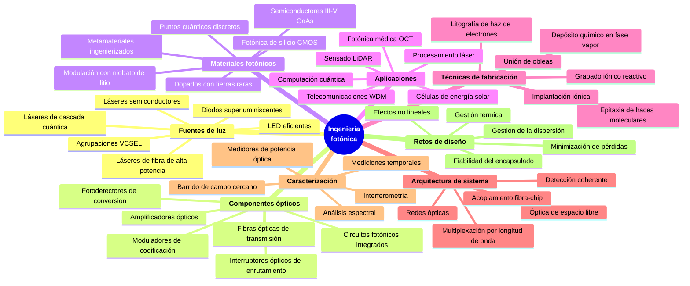

```mermaid
mindmap
  root((<b>Ingeniería<br>fotónica</b>))
    <b>Fuentes de luz</b>
      Láseres semiconductores
      Láseres de fibra de alta potencia
      LED eficientes
      Agrupaciones VCSEL
      Láseres de cascada cuántica
      Diodos superluminiscentes
    <b>Componentes ópticos</b>
      Fibras ópticas de transmisión
      Circuitos fotónicos integrados
      Amplificadores ópticos
      Moduladores de codificación
      Fotodetectores de conversión
      Interruptores ópticos de enrutamiento
    <b>Materiales fotónicos</b>
      Semiconductores III-V GaAs
      Fotónica de silicio CMOS
      Modulación con niobato de litio
      Dopados con tierras raras
      Metamateriales ingenierizados
      Puntos cuánticos discretos
    <b>Aplicaciones</b>
      Telecomunicaciones WDM
      Fotónica médica OCT
      Sensado LiDAR
      Células de energía solar
      Computación cuántica
      Procesamiento láser
    <b>Técnicas de fabricación</b>
      Epitaxia de haces moleculares
      Depósito químico en fase vapor
      Litografía de haz de electrones
      Unión de obleas
      Implantación iónica
      Grabado iónico reactivo
    <b>Arquitectura de sistema</b>
      Multiplexación por longitud de onda
      Detección coherente
      Óptica de espacio libre
      Acoplamiento fibra-chip
      Redes ópticas
    <b>Caracterización</b>
      Análisis espectral
      Mediciones temporales
      Barrido de campo cercano
      Medidores de potencia óptica
      Interferometría
    <b>Retos de diseño</b>
      Gestión de la dispersión
      Efectos no lineales
      Gestión térmica
      Fiabilidad del encapsulado
      Minimización de pérdidas
```
