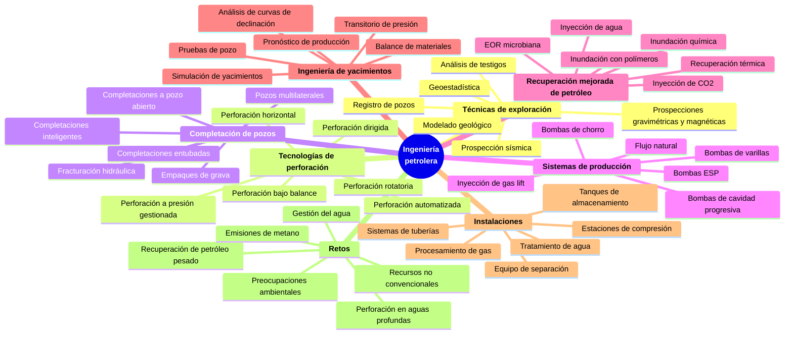

```mermaid
mindmap
  root((<b>Ingeniería<br>petrolera</b>))
    <b>Técnicas de exploración</b>
      Prospección sísmica
      Prospecciones gravimétricas y magnéticas
      Registro de pozos
      Análisis de testigos
      Modelado geológico
      Geoestadística
    <b>Tecnologías de perforación</b>
      Perforación rotatoria
      Perforación dirigida
      Perforación horizontal
      Perforación bajo balance
      Perforación a presión gestionada
      Perforación automatizada
    <b>Completación de pozos</b>
      Completaciones entubadas
      Completaciones a pozo abierto
      Empaques de grava
      Fracturación hidráulica
      Pozos multilaterales
      Completaciones inteligentes
    <b>Sistemas de producción</b>
      Flujo natural
      Inyección de gas lift
      Bombas ESP
      Bombas de varillas
      Bombas de cavidad progresiva
      Bombas de chorro
    <b>Recuperación mejorada de petróleo</b>
      Inyección de agua
      Inyección de CO2
      Recuperación térmica
      Inundación química
      EOR microbiana
      Inundación con polímeros
    <b>Ingeniería de yacimientos</b>
      Balance de materiales
      Análisis de curvas de declinación
      Pruebas de pozo
      Transitorio de presión
      Simulación de yacimientos
      Pronóstico de producción
    <b>Instalaciones</b>
      Equipo de separación
      Procesamiento de gas
      Tratamiento de agua
      Sistemas de tuberías
      Tanques de almacenamiento
      Estaciones de compresión
    <b>Retos</b>
      Recursos no convencionales
      Perforación en aguas profundas
      Recuperación de petróleo pesado
      Preocupaciones ambientales
      Gestión del agua
      Emisiones de metano
```
