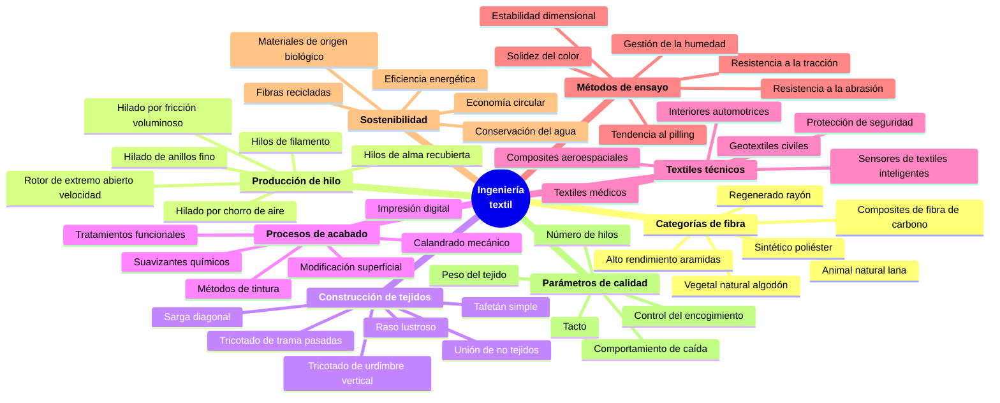

```mermaid
mindmap
  root((<b>Ingeniería<br>textil</b>))
    <b>Categorías de fibra</b>
      Vegetal natural algodón
      Animal natural lana
      Sintético poliéster
      Regenerado rayón
      Alto rendimiento aramidas
      Composites de fibra de carbono
    <b>Producción de hilo</b>
      Hilado de anillos fino
      Rotor de extremo abierto velocidad
      Hilado por chorro de aire
      Hilado por fricción voluminoso
      Hilos de alma recubierta
      Hilos de filamento
    <b>Construcción de tejidos</b>
      Tafetán simple
      Sarga diagonal
      Raso lustroso
      Tricotado de trama pasadas
      Tricotado de urdimbre vertical
      Unión de no tejidos
    <b>Procesos de acabado</b>
      Calandrado mecánico
      Suavizantes químicos
      Métodos de tintura
      Impresión digital
      Tratamientos funcionales
      Modificación superficial
    <b>Textiles técnicos</b>
      Geotextiles civiles
      Textiles médicos
      Protección de seguridad
      Interiores automotrices
      Sensores de textiles inteligentes
      Composites aeroespaciales
    <b>Métodos de ensayo</b>
      Resistencia a la tracción
      Resistencia a la abrasión
      Tendencia al pilling
      Solidez del color
      Estabilidad dimensional
      Gestión de la humedad
    <b>Sostenibilidad</b>
      Fibras recicladas
      Materiales de origen biológico
      Conservación del agua
      Eficiencia energética
      Economía circular
    <b>Parámetros de calidad</b>
      Peso del tejido
      Número de hilos
      Tacto
      Comportamiento de caída
      Control del encogimiento
```
