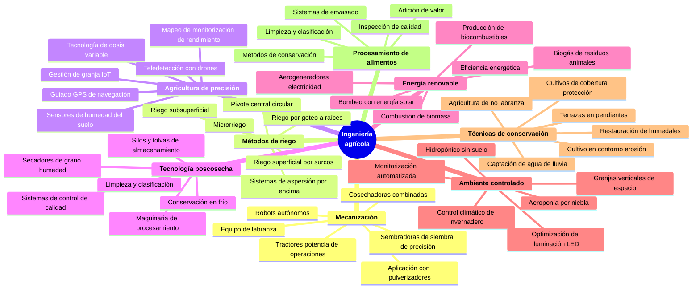

```mermaid
mindmap
  root((<b>Ingeniería<br>agrícola</b>))
    <b>Mecanización</b>
      Tractores potencia de operaciones
      Cosechadoras combinadas
      Sembradoras de siembra de precisión
      Aplicación con pulverizadores
      Robots autónomos
      Equipo de labranza
    <b>Métodos de riego</b>
      Riego superficial por surcos
      Sistemas de aspersión por encima
      Riego por goteo a raíces
      Pivote central circular
      Riego subsuperficial
      Microrriego
    <b>Agricultura de precisión</b>
      Guiado GPS de navegación
      Tecnología de dosis variable
      Teledetección con drones
      Mapeo de monitorización de rendimiento
      Sensores de humedad del suelo
      Gestión de granja IoT
    <b>Tecnología poscosecha</b>
      Secadores de grano humedad
      Silos y tolvas de almacenamiento
      Limpieza y clasificación
      Conservación en frío
      Maquinaria de procesamiento
      Sistemas de control de calidad
    <b>Energía renovable</b>
      Bombeo con energía solar
      Biogás de residuos animales
      Combustión de biomasa
      Aerogeneradores electricidad
      Producción de biocombustibles
      Eficiencia energética
    <b>Ambiente controlado</b>
      Control climático de invernadero
      Hidropónico sin suelo
      Granjas verticales de espacio
      Optimización de iluminación LED
      Monitorización automatizada
      Aeroponía por niebla
    <b>Técnicas de conservación</b>
      Cultivo en contorno erosión
      Terrazas en pendientes
      Cultivos de cobertura protección
      Restauración de humedales
      Captación de agua de lluvia
      Agricultura de no labranza
    <b>Procesamiento de alimentos</b>
      Limpieza y clasificación
      Sistemas de envasado
      Inspección de calidad
      Métodos de conservación
      Adición de valor
```
