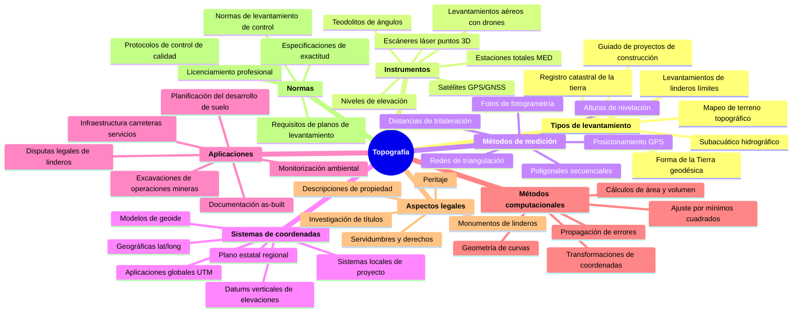

```mermaid
mindmap
  root((<b>Topografía</b>))
    <b>Tipos de levantamiento</b>
      Levantamientos de linderos límites
      Mapeo de terreno topográfico
      Guiado de proyectos de construcción
      Forma de la Tierra geodésica
      Subacuático hidrográfico
      Registro catastral de la tierra
    <b>Instrumentos</b>
      Estaciones totales MED
      Satélites GPS/GNSS
      Niveles de elevación
      Teodolitos de ángulos
      Escáneres láser puntos 3D
      Levantamientos aéreos con drones
    <b>Métodos de medición</b>
      Poligonales secuenciales
      Redes de triangulación
      Distancias de trilateración
      Alturas de nivelación
      Posicionamiento GPS
      Fotos de fotogrametría
    <b>Sistemas de coordenadas</b>
      Plano estatal regional
      Aplicaciones globales UTM
      Geográficas lat/long
      Sistemas locales de proyecto
      Datums verticales de elevaciones
      Modelos de geoide
    <b>Aplicaciones</b>
      Planificación del desarrollo de suelo
      Infraestructura carreteras servicios
      Excavaciones de operaciones mineras
      Monitorización ambiental
      Disputas legales de linderos
      Documentación as-built
    <b>Métodos computacionales</b>
      Ajuste por mínimos cuadrados
      Transformaciones de coordenadas
      Propagación de errores
      Cálculos de área y volumen
      Geometría de curvas
    <b>Aspectos legales</b>
      Descripciones de propiedad
      Servidumbres y derechos
      Monumentos de linderos
      Investigación de títulos
      Peritaje
    <b>Normas</b>
      Especificaciones de exactitud
      Licenciamiento profesional
      Requisitos de planos de levantamiento
      Normas de levantamiento de control
      Protocolos de control de calidad
```
