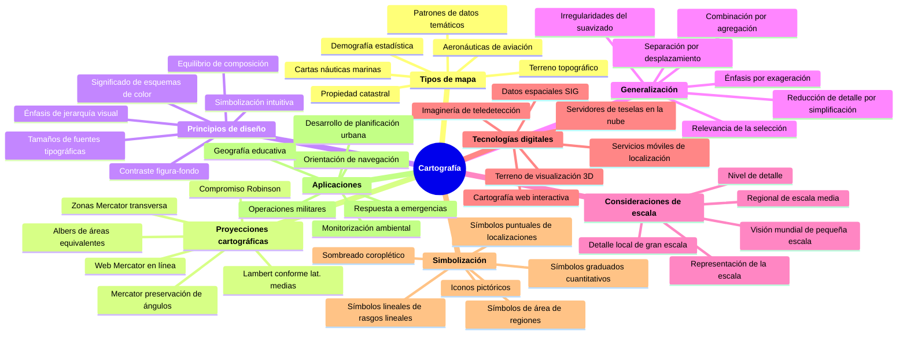

```mermaid
mindmap
  root((<b>Cartografía</b>))
    <b>Tipos de mapa</b>
      Terreno topográfico
      Patrones de datos temáticos
      Cartas náuticas marinas
      Aeronáuticas de aviación
      Propiedad catastral
      Demografía estadística
    <b>Proyecciones cartográficas</b>
      Mercator preservación de ángulos
      Zonas Mercator transversa
      Lambert conforme lat. medias
      Albers de áreas equivalentes
      Compromiso Robinson
      Web Mercator en línea
    <b>Principios de diseño</b>
      Énfasis de jerarquía visual
      Significado de esquemas de color
      Tamaños de fuentes tipográficas
      Simbolización intuitiva
      Equilibrio de composición
      Contraste figura-fondo
    <b>Generalización</b>
      Relevancia de la selección
      Reducción de detalle por simplificación
      Irregularidades del suavizado
      Combinación por agregación
      Separación por desplazamiento
      Énfasis por exageración
    <b>Consideraciones de escala</b>
      Detalle local de gran escala
      Regional de escala media
      Visión mundial de pequeña escala
      Representación de la escala
      Nivel de detalle
    <b>Tecnologías digitales</b>
      Datos espaciales SIG
      Imaginería de teledetección
      Cartografía web interactiva
      Terreno de visualización 3D
      Servicios móviles de localización
      Servidores de teselas en la nube
    <b>Simbolización</b>
      Símbolos puntuales de localizaciones
      Símbolos lineales de rasgos lineales
      Símbolos de área de regiones
      Iconos pictóricos
      Símbolos graduados cuantitativos
      Sombreado coroplético
    <b>Aplicaciones</b>
      Orientación de navegación
      Desarrollo de planificación urbana
      Monitorización ambiental
      Operaciones militares
      Geografía educativa
      Respuesta a emergencias
```
