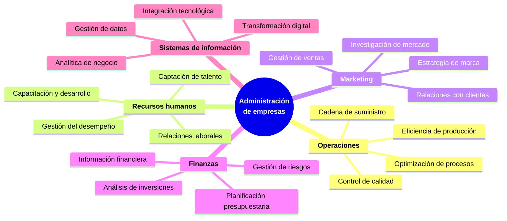

```mermaid
mindmap
  root((<b>Administración<br>de empresas</b>))
    <b>Operaciones</b>
      Optimización de procesos
      Control de calidad
      Cadena de suministro
      Eficiencia de producción
    <b>Recursos humanos</b>
      Captación de talento
      Capacitación y desarrollo
      Gestión del desempeño
      Relaciones laborales
    <b>Marketing</b>
      Investigación de mercado
      Estrategia de marca
      Relaciones con clientes
      Gestión de ventas
    <b>Finanzas</b>
      Planificación presupuestaria
      Análisis de inversiones
      Gestión de riesgos
      Información financiera
    <b>Sistemas de información</b>
      Gestión de datos
      Integración tecnológica
      Analítica de negocio
      Transformación digital
```
