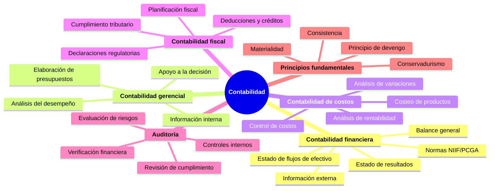

```mermaid
mindmap
  root((<b>Contabilidad</b>))
    <b>Contabilidad financiera</b>
      Información externa
      Normas NIIF/PCGA
      Balance general
      Estado de resultados
      Estado de flujos de efectivo
    <b>Contabilidad gerencial</b>
      Información interna
      Elaboración de presupuestos
      Análisis del desempeño
      Apoyo a la decisión
    <b>Contabilidad de costos</b>
      Costeo de productos
      Análisis de variaciones
      Control de costos
      Análisis de rentabilidad
    <b>Contabilidad fiscal</b>
      Cumplimiento tributario
      Planificación fiscal
      Deducciones y créditos
      Declaraciones regulatorias
    <b>Auditoría</b>
      Verificación financiera
      Controles internos
      Revisión de cumplimiento
      Evaluación de riesgos
    <b>Principios fundamentales</b>
      Principio de devengo
      Conservadurismo
      Consistencia
      Materialidad
```
