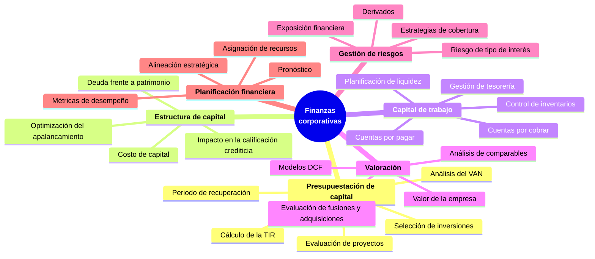

```mermaid
mindmap
  root((<b>Finanzas<br>corporativas</b>))
    <b>Presupuestación de capital</b>
      Evaluación de proyectos
      Análisis del VAN
      Cálculo de la TIR
      Periodo de recuperación
      Selección de inversiones
    <b>Estructura de capital</b>
      Deuda frente a patrimonio
      Costo de capital
      Optimización del apalancamiento
      Impacto en la calificación crediticia
    <b>Capital de trabajo</b>
      Gestión de tesorería
      Control de inventarios
      Cuentas por cobrar
      Cuentas por pagar
      Planificación de liquidez
    <b>Valoración</b>
      Modelos DCF
      Análisis de comparables
      Evaluación de fusiones y adquisiciones
      Valor de la empresa
    <b>Gestión de riesgos</b>
      Exposición financiera
      Derivados
      Estrategias de cobertura
      Riesgo de tipo de interés
    <b>Planificación financiera</b>
      Pronóstico
      Alineación estratégica
      Asignación de recursos
      Métricas de desempeño
```
