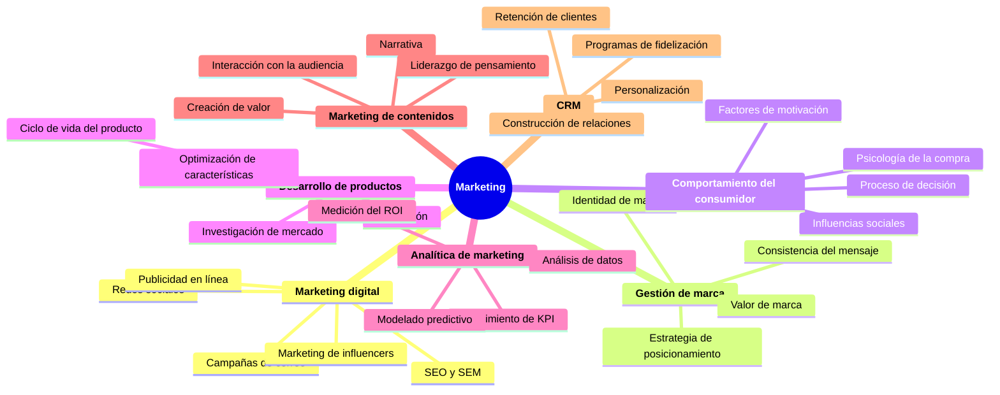

```mermaid
mindmap
  root((<b>Marketing</b>))
    <b>Marketing digital</b>
      SEO y SEM
      Redes sociales
      Campañas de correo
      Marketing de influencers
      Publicidad en línea
    <b>Gestión de marca</b>
      Identidad de marca
      Valor de marca
      Estrategia de posicionamiento
      Consistencia del mensaje
    <b>Comportamiento del consumidor</b>
      Psicología de la compra
      Proceso de decisión
      Influencias sociales
      Factores de motivación
    <b>Desarrollo de productos</b>
      Investigación de mercado
      Innovación
      Ciclo de vida del producto
      Optimización de características
    <b>Analítica de marketing</b>
      Análisis de datos
      Seguimiento de KPI
      Medición del ROI
      Modelado predictivo
    <b>Marketing de contenidos</b>
      Narrativa
      Creación de valor
      Interacción con la audiencia
      Liderazgo de pensamiento
    <b>CRM</b>
      Retención de clientes
      Programas de fidelización
      Personalización
      Construcción de relaciones
```
