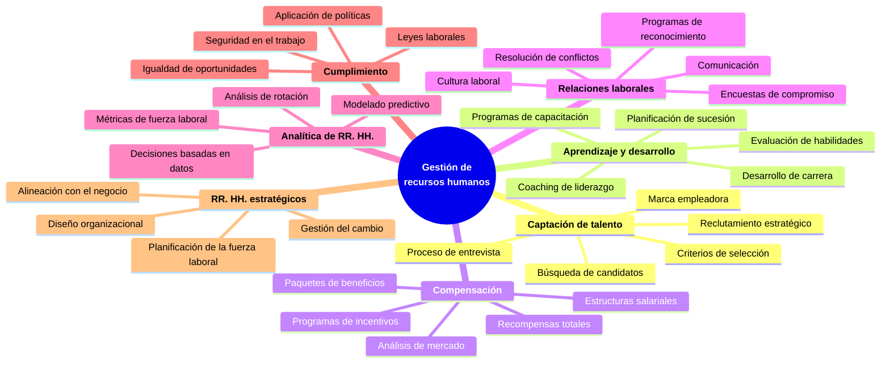

```mermaid
mindmap
  root((<b>Gestión de<br>recursos humanos</b>))
    <b>Captación de talento</b>
      Reclutamiento estratégico
      Búsqueda de candidatos
      Proceso de entrevista
      Criterios de selección
      Marca empleadora
    <b>Aprendizaje y desarrollo</b>
      Programas de capacitación
      Desarrollo de carrera
      Coaching de liderazgo
      Evaluación de habilidades
      Planificación de sucesión
    <b>Compensación</b>
      Estructuras salariales
      Programas de incentivos
      Paquetes de beneficios
      Recompensas totales
      Análisis de mercado
    <b>Relaciones laborales</b>
      Cultura laboral
      Resolución de conflictos
      Encuestas de compromiso
      Programas de reconocimiento
      Comunicación
    <b>Analítica de RR. HH.</b>
      Métricas de fuerza laboral
      Análisis de rotación
      Modelado predictivo
      Decisiones basadas en datos
    <b>Cumplimiento</b>
      Leyes laborales
      Seguridad en el trabajo
      Igualdad de oportunidades
      Aplicación de políticas
    <b>RR. HH. estratégicos</b>
      Alineación con el negocio
      Diseño organizacional
      Gestión del cambio
      Planificación de la fuerza laboral
```
