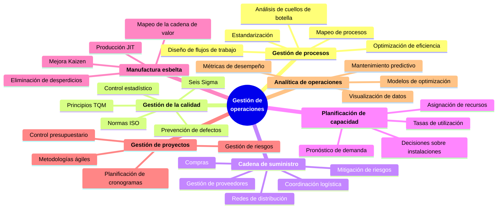

```mermaid
mindmap
  root((<b>Gestión de<br>operaciones</b>))
    <b>Gestión de procesos</b>
      Diseño de flujos de trabajo
      Mapeo de procesos
      Análisis de cuellos de botella
      Optimización de eficiencia
      Estandarización
    <b>Gestión de la calidad</b>
      Principios TQM
      Normas ISO
      Seis Sigma
      Control estadístico
      Prevención de defectos
    <b>Cadena de suministro</b>
      Compras
      Coordinación logística
      Gestión de proveedores
      Redes de distribución
      Mitigación de riesgos
    <b>Planificación de capacidad</b>
      Pronóstico de demanda
      Asignación de recursos
      Decisiones sobre instalaciones
      Tasas de utilización
    <b>Manufactura esbelta</b>
      Eliminación de desperdicios
      Producción JIT
      Mapeo de la cadena de valor
      Mejora Kaizen
    <b>Gestión de proyectos</b>
      Metodologías ágiles
      Planificación de cronogramas
      Control presupuestario
      Gestión de riesgos
    <b>Analítica de operaciones</b>
      Métricas de desempeño
      Visualización de datos
      Mantenimiento predictivo
      Modelos de optimización
```
