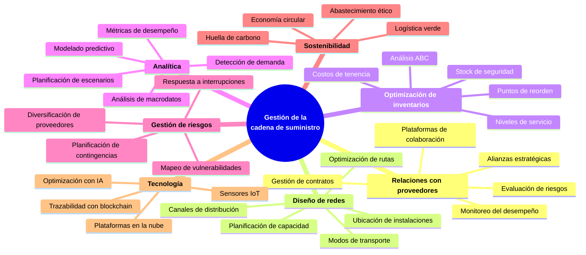

```mermaid
mindmap
  root((<b>Gestión de la<br>cadena de suministro</b>))
    <b>Relaciones con proveedores</b>
      Alianzas estratégicas
      Monitoreo del desempeño
      Plataformas de colaboración
      Evaluación de riesgos
      Gestión de contratos
    <b>Diseño de redes</b>
      Ubicación de instalaciones
      Modos de transporte
      Canales de distribución
      Optimización de rutas
      Planificación de capacidad
    <b>Optimización de inventarios</b>
      Stock de seguridad
      Análisis ABC
      Puntos de reorden
      Costos de tenencia
      Niveles de servicio
    <b>Analítica</b>
      Detección de demanda
      Modelado predictivo
      Análisis de macrodatos
      Planificación de escenarios
      Métricas de desempeño
    <b>Gestión de riesgos</b>
      Mapeo de vulnerabilidades
      Planificación de contingencias
      Respuesta a interrupciones
      Diversificación de proveedores
    <b>Sostenibilidad</b>
      Economía circular
      Abastecimiento ético
      Huella de carbono
      Logística verde
    <b>Tecnología</b>
      Trazabilidad con blockchain
      Sensores IoT
      Optimización con IA
      Plataformas en la nube
```
