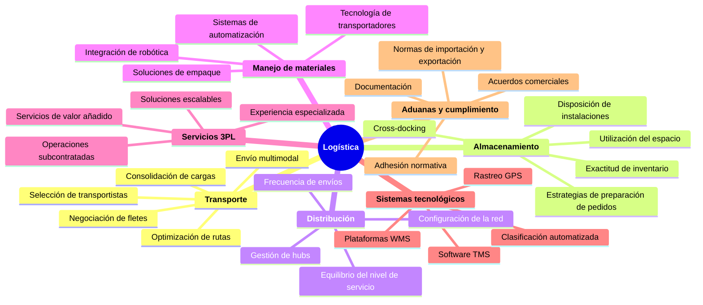

```mermaid
mindmap
  root((<b>Logística</b>))
    <b>Transporte</b>
      Selección de transportistas
      Optimización de rutas
      Consolidación de cargas
      Negociación de fletes
      Envío multimodal
    <b>Almacenamiento</b>
      Disposición de instalaciones
      Estrategias de preparación de pedidos
      Cross-docking
      Exactitud de inventario
      Utilización del espacio
    <b>Distribución</b>
      Configuración de la red
      Frecuencia de envíos
      Equilibrio del nivel de servicio
      Gestión de hubs
    <b>Manejo de materiales</b>
      Sistemas de automatización
      Tecnología de transportadores
      Integración de robótica
      Soluciones de empaque
    <b>Servicios 3PL</b>
      Operaciones subcontratadas
      Experiencia especializada
      Soluciones escalables
      Servicios de valor añadido
    <b>Sistemas tecnológicos</b>
      Plataformas WMS
      Software TMS
      Rastreo GPS
      Clasificación automatizada
    <b>Aduanas y cumplimiento</b>
      Adhesión normativa
      Documentación
      Acuerdos comerciales
      Normas de importación y exportación
```
