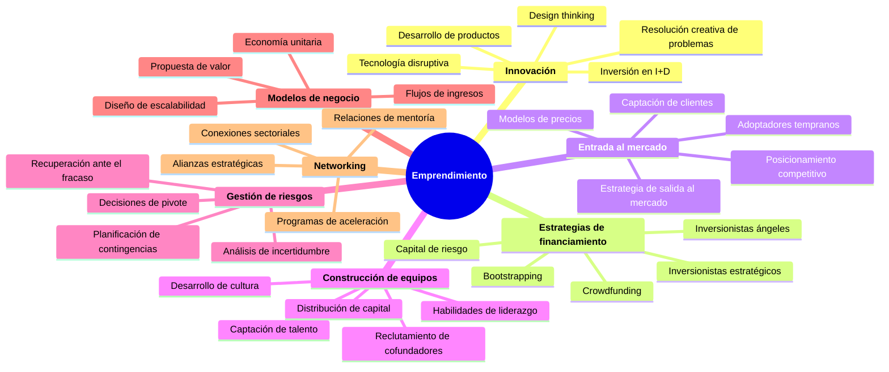

```mermaid
mindmap
  root((<b>Emprendimiento</b>))
    <b>Innovación</b>
      Design thinking
      Tecnología disruptiva
      Desarrollo de productos
      Resolución creativa de problemas
      Inversión en I+D
    <b>Estrategias de financiamiento</b>
      Bootstrapping
      Inversionistas ángeles
      Capital de riesgo
      Crowdfunding
      Inversionistas estratégicos
    <b>Entrada al mercado</b>
      Posicionamiento competitivo
      Captación de clientes
      Modelos de precios
      Estrategia de salida al mercado
      Adoptadores tempranos
    <b>Construcción de equipos</b>
      Reclutamiento de cofundadores
      Desarrollo de cultura
      Captación de talento
      Habilidades de liderazgo
      Distribución de capital
    <b>Gestión de riesgos</b>
      Análisis de incertidumbre
      Planificación de contingencias
      Decisiones de pivote
      Recuperación ante el fracaso
    <b>Modelos de negocio</b>
      Propuesta de valor
      Flujos de ingresos
      Diseño de escalabilidad
      Economía unitaria
    <b>Networking</b>
      Relaciones de mentoría
      Alianzas estratégicas
      Conexiones sectoriales
      Programas de aceleración
```
