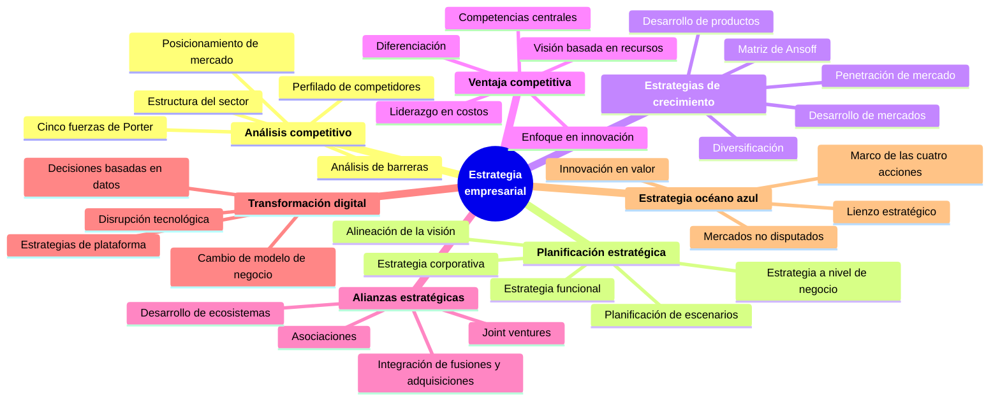

```mermaid
mindmap
  root((<b>Estrategia<br>empresarial</b>))
    <b>Análisis competitivo</b>
      Cinco fuerzas de Porter
      Perfilado de competidores
      Posicionamiento de mercado
      Estructura del sector
      Análisis de barreras
    <b>Planificación estratégica</b>
      Estrategia corporativa
      Estrategia a nivel de negocio
      Estrategia funcional
      Planificación de escenarios
      Alineación de la visión
    <b>Estrategias de crecimiento</b>
      Penetración de mercado
      Desarrollo de productos
      Desarrollo de mercados
      Diversificación
      Matriz de Ansoff
    <b>Ventaja competitiva</b>
      Liderazgo en costos
      Diferenciación
      Enfoque en innovación
      Visión basada en recursos
      Competencias centrales
    <b>Alianzas estratégicas</b>
      Joint ventures
      Integración de fusiones y adquisiciones
      Asociaciones
      Desarrollo de ecosistemas
    <b>Transformación digital</b>
      Disrupción tecnológica
      Estrategias de plataforma
      Decisiones basadas en datos
      Cambio de modelo de negocio
    <b>Estrategia océano azul</b>
      Innovación en valor
      Mercados no disputados
      Lienzo estratégico
      Marco de las cuatro acciones
```
