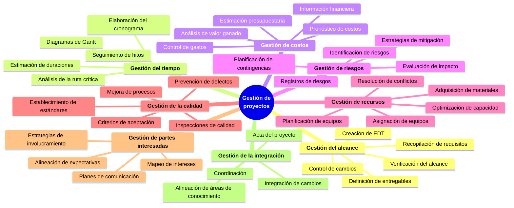

```mermaid
mindmap
  root((<b>Gestión de<br>proyectos</b>))
    <b>Gestión del alcance</b>
      Recopilación de requisitos
      Creación de EDT
      Verificación del alcance
      Control de cambios
      Definición de entregables
    <b>Gestión del tiempo</b>
      Elaboración del cronograma
      Análisis de la ruta crítica
      Diagramas de Gantt
      Seguimiento de hitos
      Estimación de duraciones
    <b>Gestión de costos</b>
      Estimación presupuestaria
      Control de gastos
      Pronóstico de costos
      Análisis de valor ganado
      Información financiera
    <b>Gestión de riesgos</b>
      Identificación de riesgos
      Evaluación de impacto
      Estrategias de mitigación
      Registros de riesgos
      Planificación de contingencias
    <b>Gestión de recursos</b>
      Asignación de equipos
      Planificación de equipos
      Adquisición de materiales
      Optimización de capacidad
      Resolución de conflictos
    <b>Gestión de la calidad</b>
      Establecimiento de estándares
      Inspecciones de calidad
      Mejora de procesos
      Prevención de defectos
      Criterios de aceptación
    <b>Gestión de partes interesadas</b>
      Mapeo de intereses
      Alineación de expectativas
      Planes de comunicación
      Estrategias de involucramiento
    <b>Gestión de la integración</b>
      Acta del proyecto
      Coordinación
      Alineación de áreas de conocimiento
      Integración de cambios
```
