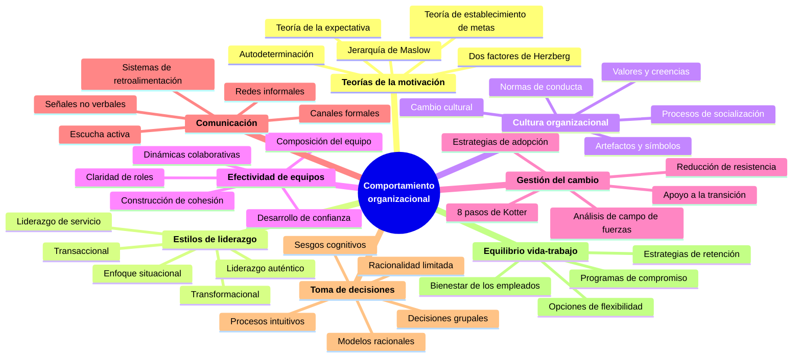

```mermaid
mindmap
  root((<b>Comportamiento<br>organizacional</b>))
    <b>Teorías de la motivación</b>
      Jerarquía de Maslow
      Dos factores de Herzberg
      Teoría de la expectativa
      Teoría de establecimiento de metas
      Autodeterminación
    <b>Estilos de liderazgo</b>
      Transformacional
      Transaccional
      Liderazgo de servicio
      Liderazgo auténtico
      Enfoque situacional
    <b>Cultura organizacional</b>
      Valores y creencias
      Artefactos y símbolos
      Normas de conducta
      Procesos de socialización
      Cambio cultural
    <b>Efectividad de equipos</b>
      Composición del equipo
      Construcción de cohesión
      Claridad de roles
      Desarrollo de confianza
      Dinámicas colaborativas
    <b>Gestión del cambio</b>
      Análisis de campo de fuerzas
      8 pasos de Kotter
      Reducción de resistencia
      Estrategias de adopción
      Apoyo a la transición
    <b>Comunicación</b>
      Canales formales
      Redes informales
      Escucha activa
      Sistemas de retroalimentación
      Señales no verbales
    <b>Toma de decisiones</b>
      Modelos racionales
      Racionalidad limitada
      Procesos intuitivos
      Decisiones grupales
      Sesgos cognitivos
    <b>Equilibrio vida-trabajo</b>
      Bienestar de los empleados
      Programas de compromiso
      Estrategias de retención
      Opciones de flexibilidad
```
