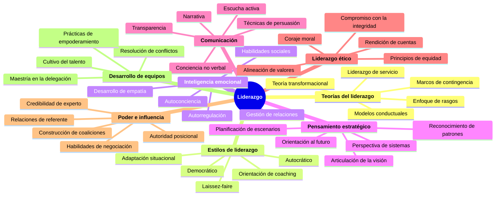

```mermaid
mindmap
  root((<b>Liderazgo</b>))
    <b>Teorías del liderazgo</b>
      Enfoque de rasgos
      Modelos conductuales
      Marcos de contingencia
      Teoría transformacional
      Liderazgo de servicio
    <b>Estilos de liderazgo</b>
      Autocrático
      Democrático
      Laissez-faire
      Orientación de coaching
      Adaptación situacional
    <b>Inteligencia emocional</b>
      Autoconciencia
      Autorregulación
      Desarrollo de empatía
      Habilidades sociales
      Gestión de relaciones
    <b>Pensamiento estratégico</b>
      Perspectiva de sistemas
      Orientación al futuro
      Reconocimiento de patrones
      Planificación de escenarios
      Articulación de la visión
    <b>Comunicación</b>
      Escucha activa
      Narrativa
      Técnicas de persuasión
      Transparencia
      Conciencia no verbal
    <b>Liderazgo ético</b>
      Compromiso con la integridad
      Rendición de cuentas
      Principios de equidad
      Coraje moral
      Alineación de valores
    <b>Poder e influencia</b>
      Autoridad posicional
      Credibilidad de experto
      Relaciones de referente
      Construcción de coaliciones
      Habilidades de negociación
    <b>Desarrollo de equipos</b>
      Cultivo del talento
      Maestría en la delegación
      Resolución de conflictos
      Prácticas de empoderamiento
```
