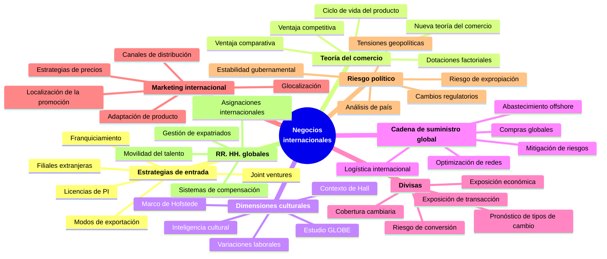

```mermaid
mindmap
  root((<b>Negocios<br>internacionales</b>))
    <b>Estrategias de entrada</b>
      Modos de exportación
      Licencias de PI
      Franquiciamiento
      Joint ventures
      Filiales extranjeras
    <b>Teoría del comercio</b>
      Ventaja comparativa
      Dotaciones factoriales
      Ciclo de vida del producto
      Nueva teoría del comercio
      Ventaja competitiva
    <b>Dimensiones culturales</b>
      Marco de Hofstede
      Contexto de Hall
      Estudio GLOBE
      Inteligencia cultural
      Variaciones laborales
    <b>Cadena de suministro global</b>
      Logística internacional
      Abastecimiento offshore
      Compras globales
      Mitigación de riesgos
      Optimización de redes
    <b>Divisas</b>
      Cobertura cambiaria
      Pronóstico de tipos de cambio
      Exposición de transacción
      Riesgo de conversión
      Exposición económica
    <b>Marketing internacional</b>
      Adaptación de producto
      Estrategias de precios
      Canales de distribución
      Localización de la promoción
      Glocalización
    <b>Riesgo político</b>
      Estabilidad gubernamental
      Cambios regulatorios
      Tensiones geopolíticas
      Riesgo de expropiación
      Análisis de país
    <b>RR. HH. globales</b>
      Gestión de expatriados
      Asignaciones internacionales
      Sistemas de compensación
      Movilidad del talento
```
