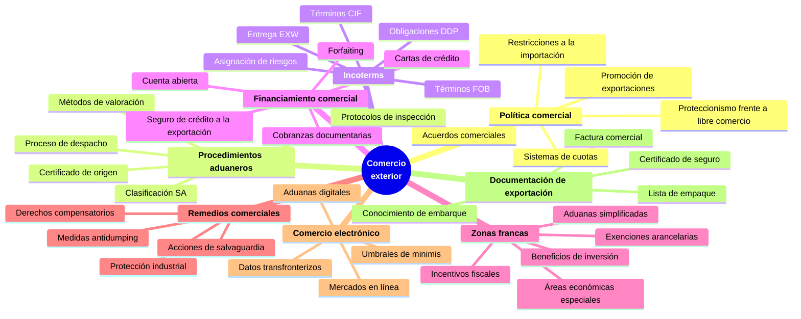

```mermaid
mindmap
  root((<b>Comercio<br>exterior</b>))
    <b>Política comercial</b>
      Proteccionismo frente a libre comercio
      Sistemas de cuotas
      Restricciones a la importación
      Promoción de exportaciones
      Acuerdos comerciales
    <b>Procedimientos aduaneros</b>
      Clasificación SA
      Certificado de origen
      Métodos de valoración
      Protocolos de inspección
      Proceso de despacho
    <b>Incoterms</b>
      Términos FOB
      Términos CIF
      Entrega EXW
      Obligaciones DDP
      Asignación de riesgos
    <b>Financiamiento comercial</b>
      Cartas de crédito
      Cobranzas documentarias
      Cuenta abierta
      Seguro de crédito a la exportación
      Forfaiting
    <b>Zonas francas</b>
      Incentivos fiscales
      Exenciones arancelarias
      Áreas económicas especiales
      Aduanas simplificadas
      Beneficios de inversión
    <b>Remedios comerciales</b>
      Medidas antidumping
      Derechos compensatorios
      Acciones de salvaguardia
      Protección industrial
    <b>Comercio electrónico</b>
      Aduanas digitales
      Datos transfronterizos
      Mercados en línea
      Umbrales de minimis
    <b>Documentación de exportación</b>
      Factura comercial
      Lista de empaque
      Conocimiento de embarque
      Certificado de seguro
```
