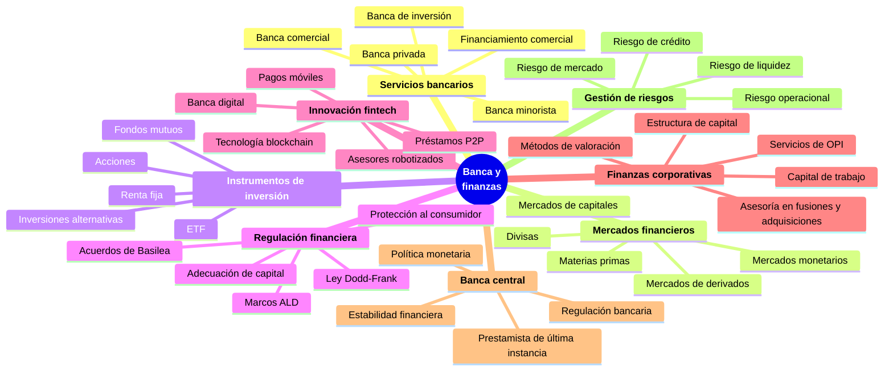

```mermaid
mindmap
  root((<b>Banca y<br>finanzas</b>))
    <b>Servicios bancarios</b>
      Banca minorista
      Banca comercial
      Banca de inversión
      Banca privada
      Financiamiento comercial
    <b>Mercados financieros</b>
      Mercados monetarios
      Mercados de capitales
      Divisas
      Mercados de derivados
      Materias primas
    <b>Instrumentos de inversión</b>
      Acciones
      Renta fija
      Fondos mutuos
      ETF
      Inversiones alternativas
    <b>Regulación financiera</b>
      Acuerdos de Basilea
      Adecuación de capital
      Protección al consumidor
      Marcos ALD
      Ley Dodd-Frank
    <b>Innovación fintech</b>
      Banca digital
      Tecnología blockchain
      Asesores robotizados
      Préstamos P2P
      Pagos móviles
    <b>Finanzas corporativas</b>
      Estructura de capital
      Capital de trabajo
      Métodos de valoración
      Asesoría en fusiones y adquisiciones
      Servicios de OPI
    <b>Banca central</b>
      Política monetaria
      Regulación bancaria
      Estabilidad financiera
      Prestamista de última instancia
    <b>Gestión de riesgos</b>
      Riesgo de crédito
      Riesgo de mercado
      Riesgo operacional
      Riesgo de liquidez
```
