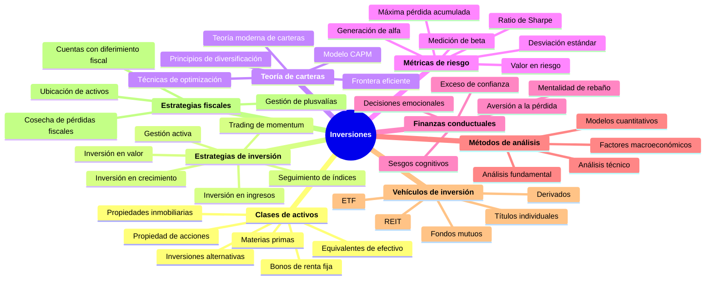

```mermaid
mindmap
  root((<b>Inversiones</b>))
    <b>Clases de activos</b>
      Propiedad de acciones
      Bonos de renta fija
      Propiedades inmobiliarias
      Materias primas
      Inversiones alternativas
      Equivalentes de efectivo
    <b>Estrategias de inversión</b>
      Inversión en valor
      Inversión en crecimiento
      Inversión en ingresos
      Seguimiento de índices
      Gestión activa
      Trading de momentum
    <b>Teoría de carteras</b>
      Teoría moderna de carteras
      Frontera eficiente
      Modelo CAPM
      Principios de diversificación
      Técnicas de optimización
    <b>Métricas de riesgo</b>
      Medición de beta
      Generación de alfa
      Ratio de Sharpe
      Desviación estándar
      Valor en riesgo
      Máxima pérdida acumulada
    <b>Finanzas conductuales</b>
      Sesgos cognitivos
      Mentalidad de rebaño
      Decisiones emocionales
      Aversión a la pérdida
      Exceso de confianza
    <b>Métodos de análisis</b>
      Análisis fundamental
      Análisis técnico
      Modelos cuantitativos
      Factores macroeconómicos
    <b>Vehículos de inversión</b>
      Fondos mutuos
      ETF
      Títulos individuales
      REIT
      Derivados
    <b>Estrategias fiscales</b>
      Cosecha de pérdidas fiscales
      Ubicación de activos
      Cuentas con diferimiento fiscal
      Gestión de plusvalías
```
